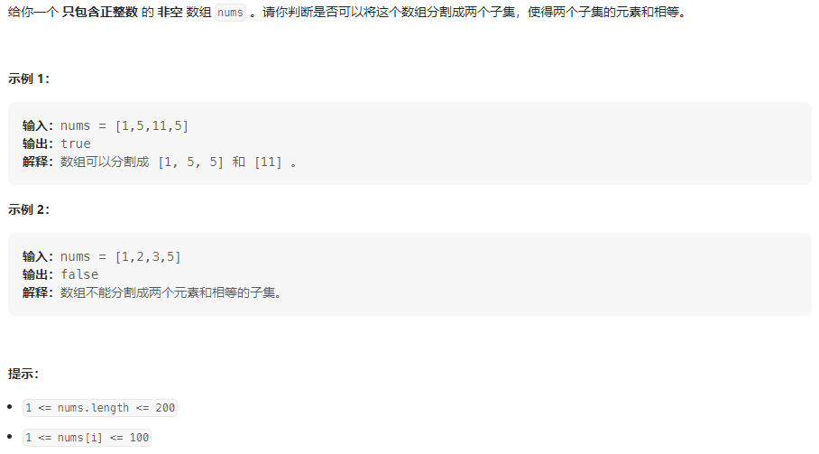
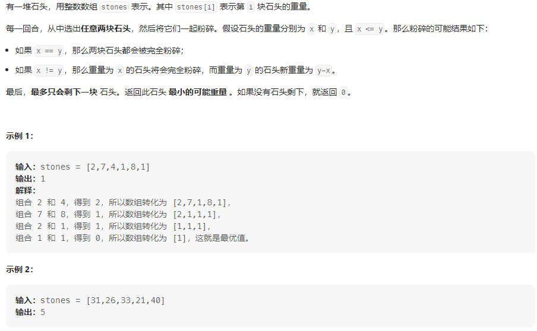
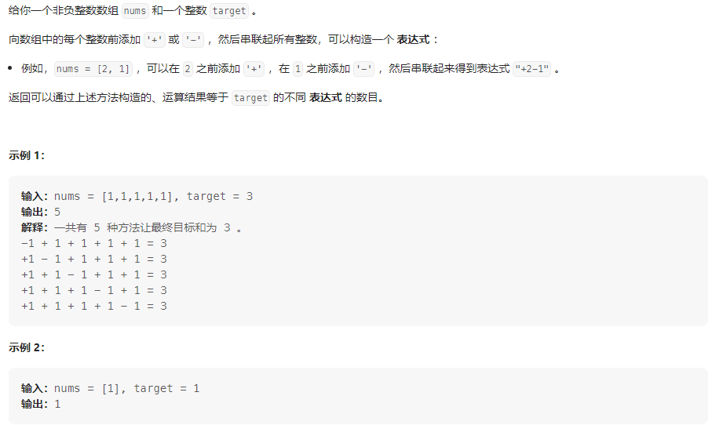
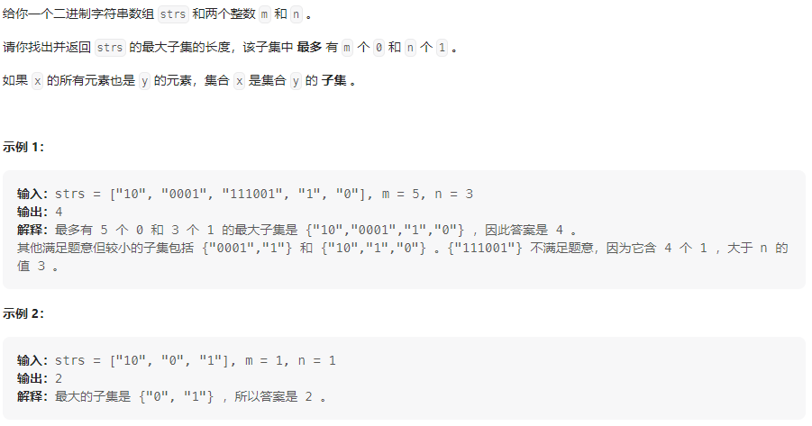

## 01背包介绍

有n件物品和一个最多能背重量为w 的背包。第i件物品的重量是weight[i]，得到的价值是value[i] 。**每件物品只能用一次**，求解将哪些物品装入背包里物品价值总和最大。


### 背包问题整体框图


<!-- more -->

### 二维数组实现01背包

考虑动规五部曲

#### 1、状态表示，确定dp数组的含义

对于背包问题，有一种写法, 是使用二维数组，即**dp[i,j]表示从下标为[0-i]的物品里任意取，放进容量为j的背包，价值总和最大是多少**。

#### 2、状态转移，确定递推方程

状态dp[i,j]由是否选择i转移而来

- 不选i，则dp[i,j] = dp[i-1,j]
- 选i，则dp[i,j] = dp[i-1, j-weight[i]] + value[i]

则状态转移方程为：dp[i,j] = max(dp[i-1. j], dp[i-1, j-weight[i]] + value[i])

#### 3、dp数组初始化

如下图所示，结合状态转移方程，每个状态都是由上面的状态和左上的状态转移而来，所以实现需要初始化第一行和第一列。

第一行表达的意义是背包容量为0时的最大价值，此时不论可选物品有多少，最大价值都是0；第一列表达的意义是，背包容量为j时，把物品0放入背包的最大价值为多少，此时只有当背包容量大于物品0的重量时，最大价值为物品0的价值，其余为0。


#### 4、循环顺序

对于二维数组的01背包问题往往两重循环，一重循环枚举物品，一重循环枚举背包容量，考虑每个状态的转移方式，先枚举物品和先枚举背包容量的方式都可以

#### 5、举例验证


### 滚动(一维)数组实现01背包

#### 1、状态表示，确定dp数组的含义

dp[j]: 表示背包容量为j时的最大价值

#### 2、状态转移，确定递推方程

由二维数组的方法中可以看出，每个i行的状态都是由上一行状态转移过来的，所以可以使用一维数组滚动，每次将更新前的一维数组作为上一行状态，更新后的一维数组作为当前行的状态

```java
// 等式右边的作为当前状态，等式左边的作为上一状态
dp[j] = max(dp[j], dp[j-weights[i]]) + values[i]);
```

####  3、dp数组初始化

dp[j]表示：容量为j的背包，所背的物品价值可以最大为dp[j]，那么dp[0]就应该是0，因为背包容量为0所背的物品的最大价值就是0。

那么dp数组除了下标0的位置，初始为0，其他下标应该初始化多少呢？

看一下递归公式：dp[j] = max(dp[j], dp[j - weight[i]] + value[i]);

dp数组在推导的时候一定是取价值最大的数，如果题目给的价值都是正整数那么非0下标都初始化为0就可以了。

**这样才能让dp数组在递归公式的过程中取的最大的价值，而不是被初始值覆盖了**。

#### 4、遍历顺序

只能先遍历物品，在遍历背包容量，且在遍历背包容量的时候要从后向前遍历，为了保证每个物品只能添加一次

## 01背包相关问题

| 题目                                                         | 题解                                                         |
| ------------------------------------------------------------ | ------------------------------------------------------------ |
| [416. 分割等和子集](https://leetcode.cn/problems/partition-equal-subset-sum/) | https://leetcode.cn/problems/partition-equal-subset-sum/solutions/2363837/san-chong-fang-fa-jie-jue-wen-ti-hui-su-9a6zt/ |
| [1049.最后一块石头的重量II](https://leetcode.cn/problems/last-stone-weight-ii/) | https://leetcode.cn/problems/target-sum/solutions/2373127/01bei-bao-shi-jian-fu-za-du-onm-by-dpbir-sxd0/ |
| [494.目标和](https://leetcode.cn/problems/target-sum/)       | https://leetcode.cn/problems/target-sum/solutions/2373127/01bei-bao-shi-jian-fu-za-du-onm-by-dpbir-sxd0/ |
| [474.一和零](https://leetcode.cn/problems/ones-and-zeroes/)  | https://leetcode.cn/problems/ones-and-zeroes/solutions/2377351/er-wei-dong-tai-gui-hua-by-dpbirder-wmt4/ |

## 416.分割等和子集

### 题目描述



### 我的思路

计算出集合的总和，原问题可转化为**能否从nums中选择一个子集和为sum/2**

#### 回溯法

#### 画出状态树，利用回溯三部曲分析问题，结果超时

#### 递归法

对于集合中每个元素都只有两种状态，选或不选，分别讨论这两种状态，最终的到一个二叉树

时间复杂度为O(2<sup>N</sup>)，超时

#### 动态规划法

将本题对应到背包问题

- 背包容量大小：sum/2
- 背包中要放入的商品(集合里的元素)，重量为元素值，价值也为元素的值
- 背包刚好装满，说明找到了总和为sum/2的值
- 背包中每一个元素不可重复放入

所以本题应该套用01背包框架

见代码注释

### 我的代码

**回溯法**

```java
class Solution {
    // 回溯
    boolean backtracing(int sum, int begin, int nums[]) {
        // 终止条件
        if (sum == 0)
            return true;
        else if (sum < 0)
            return false;
        // 单层逻辑
        for (int i = begin; i < nums.length; i++) {
            // 同一层去重
            if (i != begin && nums[i] == nums[i - 1])
                continue;
            // 这里只要判断是否存在，而不需要返回路径，所以不需要一个vec向量来保存路径
            if (backtracing(sum - nums[i], i + 1, nums))
                return true;
        }
        return false;
    }

    public boolean canPartition(int[] nums) {
        // 求和
        Arrays.sort(nums);
        int sum = 0;
        int n = nums.length;
        for (int i = 0; i < n; i++)
            sum += nums[i];
        if (sum % 2 != 0)
            return false;
        System.out.println(Arrays.toString(nums));
        // 问题转化：能否从nums中选择一个子集和为sum/2
        return backtracing(sum / 2, 0, nums);
    }
}
```

**递归法**

```java
class Solution {
    // 递归, 判断集合[id,nums.length]是否存在和为sum的子集
    boolean recursion(int nums[], int sum, int id) {
        // 终止条件
        if (sum == 0)
            return true;
        else if (sum < 0 || id == nums.length)
            return false;
        // 递归逻辑
        return recursion(nums, sum - nums[id], id + 1) || recursion(nums, sum, id + 1);
    }

    public boolean canPartition(int[] nums) {
        // 求和
        Arrays.sort(nums);
        int sum = 0;
        int n = nums.length;
        for (int i = 0; i < n; i++)
            sum += nums[i];
        if (sum % 2 != 0)
            return false;
        // System.out.println(Arrays.toString(nums));
        // 问题转化：能否从nums中选择一个子集和为sum/2
        return recursion(nums, sum / 2, 0);
    }
}
```

**01背包——二维数组解法**

```java
class Solution {
    // 动态规划
    public boolean canPartition(int[] nums) {
        // 求和
        int sum = 0;
        int n = nums.length;
        for (int i = 0; i < n; i++)
            sum += nums[i];
        if (sum % 2 != 0)
            return false;
        // 问题转化：能否从nums中选择一个子集和为sum/2
        // 状态定义：dp[i][j]: 能否从[0~i]中找出和为j的子集
        boolean[][] dp = new boolean[nums.length + 5][sum / 2 + 5];
        // 递推方程: dp[i][j] = dp[i-1][j] || dp[i-1][j-nums[i]]
        // 前者表示这样的子集中不含元素i，后者表示这样的子集中包含元素i
        // 初始化，第一列全为true，第一行，若nums[0] == j，则为true，反之false
        for (int j = 1; j <= sum / 2; j++)
            dp[0][j] = (nums[0] == j);
        for (int i = 0; i < nums.length; i++)
            dp[i][0] = true;
        // print(dp);
        // 循环过程，两种都可以
        for (int i = 1; i < nums.length; i++) {
            for (int j = 1; j <= sum / 2; j++) {
                if (j >= nums[i])
                    dp[i][j] = dp[i - 1][j] || dp[i - 1][j - nums[i]];
                else
                    dp[i][j] = dp[i - 1][j];
            }
        }
        // print(dp);
        return dp[nums.length - 1][sum / 2];
    }

    // debug
    void print(boolean nums[][]) {
        for (int i = 0; i < nums.length; i++) {
            System.out.println(Arrays.toString(nums[i]));
        }
    }
}
```

**01背包——一维数组解法**

```java
class Solution {
    // 01背包——一维数组
    public boolean canPartition(int[] nums) {
        // 求和
        int sum = 0;
        int n = nums.length;
        for (int i = 0; i < n; i++)
            sum += nums[i];
        if (sum % 2 != 0)
            return false;
        // 问题转化：能否从nums中选择一个子集和为sum/2
        // 状态表示dp[j]: 容量为j的背包能装物品的最大价值
        int dp[] = new int[sum / 2 + 1];
        // 递推公式：dp[j] = max(dp[j], dp[j-nums[i]]+nums[i])
        // 循环顺序
        for (int i = 0; i < nums.length; i++) {
            for (int j = sum / 2; j >= nums[i]; j--) {
                dp[j] = Math.max(dp[j], dp[j - nums[i]] + nums[i]);
            }
        }
        return dp[sum / 2] == sum / 2;
    }
}
```

## 1049.最后一块石头的重量II

### 题目描述



### 我的思路

将本题转化为背包问题，记石头重量总和为sum，原问题可描述为bag = sum/2的背包所装的石头的最大重量，与剩余石头重量抵消后的剩余石头重量

- 背包容量为 bag
- 背包中的物品（石头），价值为石头的重量，重量为石头的重量
- 背包中每个物品只能取一次

则该问题为01背包问题，下面用01背包的模板即可

### 我的代码

01背包——二维数组版

```java
class Solution {
    public int lastStoneWeightII(int[] stones) {
        int sum = 0;
        for (int i = 0; i < stones.length; i++)
            sum += stones[i];
        // dp[i][j]: 对于物品[0~i]中背包容量为j时所能装的最大物品价值
        int[][] dp = new int[stones.length][sum / 2 + 1];
        // 递推方程：dp[i][j] = max(dp[i-1][j], dp[i-1][j-stones[i]] + stones[i])
        // 前者表示不包含元素i，后者表示包含元素i
        // 初始化
        for (int j = stones[0]; j < dp[0].length; j++)
            dp[0][j] = stones[0];
        // 遍历顺序： 从前向后
        for (int i = 1; i < stones.length; i++) {
            for (int j = 0; j < dp[i].length; j++) {
                if (j < stones[i])
                    dp[i][j] = dp[i - 1][j];
                else
                    dp[i][j] = Math.max(dp[i - 1][j], dp[i - 1][j - stones[i]] + stones[i]);
            }
        }
        return sum - dp[stones.length - 1][sum / 2] - dp[stones.length - 1][sum / 2];
    }
}
```

01背包——一维数组版

```java
class Solution {
    public int lastStoneWeightII(int[] stones) {
        int sum = 0;
        for (int stone : stones)
            sum += stone;
        int bag = sum / 2;

        // dp[j]: 容量为j的背包所能装物品的最大价值
        int dp[] = new int[bag + 1];
        // 递推公式：dp[j] = max(dp[j], dp[j-stones[i]] + stones[j])
        // 初始化 省略
        for (int i = 0; i < stones.length; i++) {
            for (int j = bag; j >= stones[i]; j--)
                dp[j] = Math.max(dp[j], dp[j - stones[i]] + stones[i]);
        }

        return sum - dp[bag] - dp[bag];
    }
}
```

## 494.目标和

### 题目描述



### 我的思路

将本题转化为背包问题，根据题意集合一定可以分为left和right两部分，而

left+right=sum，要是left-right=target，只需使left = (sum + target)/2

则原问题可以转化为从集合nums中选择若干个数使其和为left，可以直接使用回溯法解决问题，只不过会超时，这里将其转化为背包问题，转换方法与[416. 分割等和子集](https://leetcode.cn/problems/partition-equal-subset-sum/)类似

- 背包容量：left
- 背包中的物品（nums中的元素），物品价值为元素大小，物品体积为元素大小
- 背包中每个物品只能选取一次

转换后可解释为：装满容量为left的背包有多少种装法，**这里需要使用01背包的方法解决组合问题**

1. 状态定义

   dp[j]: 容量为j的背包有dp[j]种组合方法

2. 递推方程

   例如：dp[j]，j 为5，

   - 已经有一个1（nums[i]） 的话，有 dp[4]种方法 凑成 容量为5的背包。
   - 已经有一个2（nums[i]） 的话，有 dp[3]种方法 凑成 容量为5的背包。
   - 已经有一个3（nums[i]） 的话，有 dp[2]中方法 凑成 容量为5的背包
   - 已经有一个4（nums[i]） 的话，有 dp[1]中方法 凑成 容量为5的背包
   - 已经有一个5 （nums[i]）的话，有 dp[0]中方法 凑成 容量为5的背包

   那么凑整dp[5]就是把所有的dp[j - nums[i]]累加起来

   所以求组合问题的公式，都是类似这种

   ```java
   // 组合问题的递推公式都是这个
   dp[j] += dp[j-nums[i]]
   ```

3. 初始化

   dp[0] = 1，从满足答案要求判断如何初始化

4. 循环方向

   物品循环从前向后，背包容量循环从后向前

### 我的代码

**01背包——一维数组版**

```java
class Solution {
    public int findTargetSumWays(int[] nums, int target) {
        // 计算背包容量
        int sum = 0;
        for (int num : nums)
            sum += num;
        // bag不存在
        if ((sum + target) % 2 == 1)
            return 0;
        // 问题无解
        if (Math.abs(target) > sum)
            return 0;
        int bag = (sum + target) / 2;
        // dp[j]: 装满容量为j的背包有多少种装法
        int dp[] = new int[bag + 1];
        dp[0] = 1;

        for (int i = 0; i < nums.length; i++) {
            for (int j = bag; j >= nums[i]; j--)
                dp[j] += dp[j - nums[i]];
        }

        return dp[bag];
    }
}
```

## 474.一和零

### 题目描述



### 我的思路

只不过这个背包有两个维度，一个是m 一个是n，而不同长度的字符串就是不同大小的待装物品。下面考虑动规五部曲

1、状态定义

dp[i,j]: 子集中最多有i个0和j个1的子集长度

2、递推公式

对于字符串str，str中0的次数为zero_times,1的次数为one_times，递推公式如下：

dp[i,j] = max(dp[i - zero_times, j - one_times]，dp[i,j]) + 1

3、初始化

dp[i,j]不为负即可

4、确定遍历顺序

外层循环遍历物品，内层循环遍历背包容量

5、模拟，省略

### 我的代码

```java
class Solution {
    public int findMaxForm(String[] strs, int m, int n) {

        // dp[i][j]: 最多i个0和j个1的strs的最大子集的大小为dp[i][j]
        int[][] dp = new int[m + 1][n + 1];
        for (String str : strs) {
            char[] s_char = str.toCharArray();
            int one_num = 0;
            for (char ch : s_char) {
                if (ch == '1')
                    one_num++;
            }
            int zero_num = s_char.length - one_num;
            for (int i = m; i >= zero_num; i--) {
                for (int j = n; j >= one_num; j--)
                    dp[i][j] = Math.max(dp[i][j], dp[i - zero_num][j - one_num] + 1);
            }
        }

        return dp[m][n];
    }
}
```

