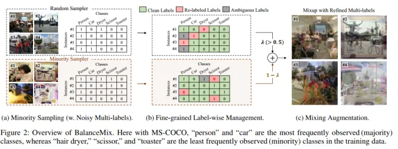
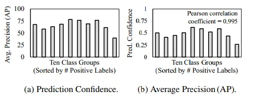
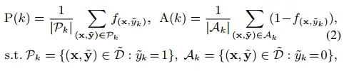
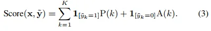
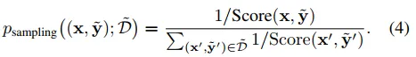
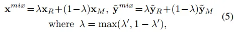
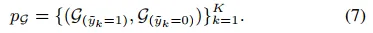
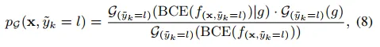
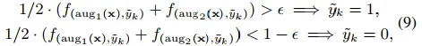
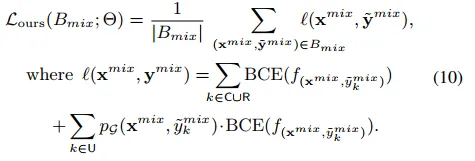

# 摘要&相关工作
多标签分类由于训练数据中标签的不平衡和噪声而面临挑战。我们提出了一种名为 BalanceMix 的统一数据增强方法来应对这些挑战。我们的方法包括两种针对不平衡标签的采样器，生成具有高度多样性的少数类增强实例。它还在标签粒度上细化多标签，将噪声标签分类为干净、重新标记或模糊的标签，以进行鲁棒的优化。在三个基准数据集上的大量实验表明，BalanceMix 优于现有的最先进方法。
问题: 多标签分类面临着训练数据中标签不平衡（某些类别标签远多于其他类别）和噪声（标签错误）的挑战。这些问题会影响模型的鲁棒性。现有方法通常分别处理标签不平衡和噪声问题，且假设数据要么干净要么假设平衡。
<!-- more -->
BalanceMix 方法: BalanceMix 通过以下两个主要组件来解决这些问题：
1. 少数类增强混合 (Minority-augmented Mixing): 为了解决类别不平衡问题，BalanceMix 使用两个采样器：一个少数类采样器，以高概率采样包含少数类标签的实例；一个随机采样器。然后，使用 Mixup 方法将少数类采样器采样的实例与随机采样器采样的实例进行插值混合，从而增加少数类实例的多样性，避免过度拟合。
2. 细粒度标签管理 (Fine-grained Label-wise Management): 为了处理噪声标签，BalanceMix 对每个标签进行细粒度分析，将其分为三类：干净标签（置信度高）、重新标记标签（模型预测置信度高，可以纠正错误标签）、模糊标签（置信度低）。 该方法利用高斯混合模型(GMM)估计每个标签的清洁概率，并根据此概率对损失函数进行加权。
# 具体方法

## Minority-augmented Mixing（少数类增强混合）
### Confidence-based Minority Sampling（基于置信度的少量采样）

传统的过采样方法都是基于正标签的频率解决样本不平衡问题的。但是由于多标签问题的复杂性，具有少量正标签的类别组并不一定总是具有较低的分类中准确性，本文基于实例的预测置信度解决样本不平衡问题。
首先计算样本的预测置信度f与mAP关联性，抽取出预测置信度低的实例，这一类实例可以认为对mAP影响较大的实例。本文作者对特定的标签k定义了两种置信度分数。

其中P为存在标签k的实例的置信度，A为缺失标签k的实例的置信度。则对于每个实例的置信度分数可以表示如下：

则实例的采样率可表示为实例置信度分数的倒数：

在训练开始阶段，少数实例被较高概率过采样，但是随着不平衡问题被缓解这类实例被过采样的程度应该降低。
### Mixing Augmentation（混合增强）
对于实例$(x_r,y_r)$和$(x_m,y_m)$混合后的结果如下：

通过随机采样保证样本的多样性，但是可能会产生样本不平衡问题，通过少量过采样缓解样本不平衡问题，但是由于缺少样本的多样性可能产生过拟合问题。为了在平衡场景下维持样本的多样性，$\lambda$需要大于等于0.5。

## Fine-grained Label-wise Management （细粒度的标签管理）
### Clean Labels（干净标签）
本文对每一个类别的BCE使用双峰单变量高斯混合模型（bi-model univariate Gaussian mixture model, GMM），使用期望最大化算法，返回2xK个GMM模型，如下式所示：

给定实例x标签k的BCE损失，干净标签概率可以通过相应的GMM模型后验概率得到：

其中g表示干净标签的模态。$p_G\gt0.5$的标记为干净标签。
### Re-labeled Labels （重标记标签）
在对噪声标签过拟合之前，如果给定标签没有被选为干净标签，但是模型在预测中标签出较高的置信度，则修改该标签。文中对基于原始实例x增强后的两个实例进行集成，则第k类可以按照如下方式进行重标记：

其中$\epsilon$为用于重标记的置信度阈值。
### Ambiguous Labels （模糊标签）
对于非干净标签和非重标记标签，视为模糊标签。这一类标签可能是不正确的，为了利用这类标签的信息，同时减少潜在的风险，文中基于干净标签概率估计的损失重要性进行加权。
## Optimization with BalanceMix（优化过程）
从随机采样器和少数类采样器中获取两个实例，首先对他们进行细粒度标签管理，将干净标签、重标记标签和模糊标签分别存储在C、R和U集合中。然后通过带有混合多标签的MixUp方法生成少数类增强的实例。BalanceMix损失函数定义如下：

[原文](BalanceMix/original.pdf)