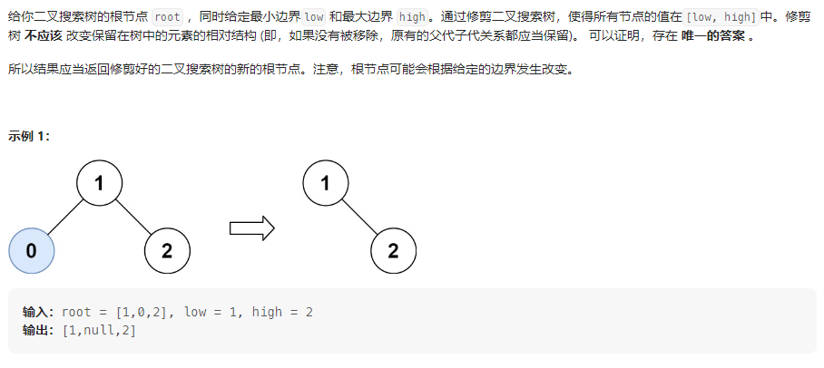
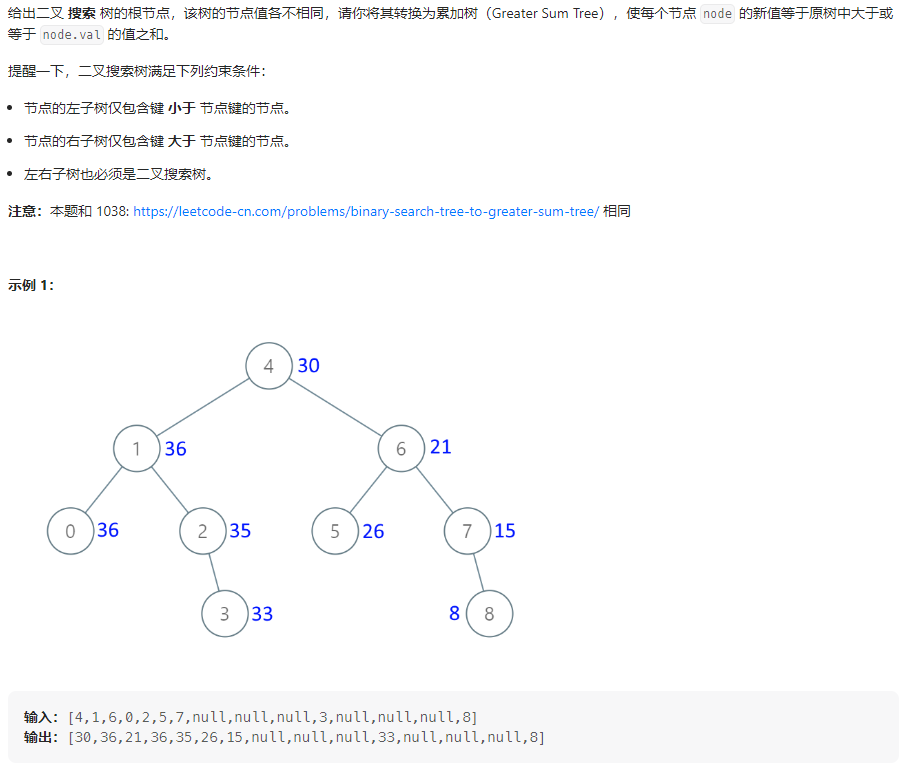

## 题目汇总

| 题目                                                         | 题解                                                         |
| ------------------------------------------------------------ | ------------------------------------------------------------ |
| [701.二叉搜索树中的插入操作](https://leetcode.cn/problems/insert-into-a-binary-search-tree/) |                                                              |
| [450.删除二叉搜索树中的节点](https://leetcode.cn/problems/delete-node-in-a-bst/) |                                                              |
| [669. 修剪二叉搜索树](https://leetcode.cn/problems/trim-a-binary-search-tree/) | https://leetcode.cn/problems/trim-a-binary-search-tree/solutions/2299625/hou-xu-guo-cheng-si-lu-jian-ji-ming-liao-yhdb/ |
| [108.将有序数组转换为二叉搜索树](https://leetcode.cn/problems/convert-sorted-array-to-binary-search-tree/) |                                                              |
| [538.把二叉搜索树转换为累加树](https://leetcode.cn/problems/convert-bst-to-greater-tree/) | https://leetcode.cn/problems/convert-bst-to-greater-tree/solutions/2300969/you-zhong-zuo-bian-li-lei-zhong-xu-bian-d969n/ |

<!-- more -->

## 669. 修剪二叉搜索树

### 题目描述



### 我的思路

**递归函数的功能：** 修剪root，并返回修剪后的结果

**终止条件：** 当root == null时， 返回null

#### 错误思路（前序）

先处理中间节点，分为如下三种情况

- 中间值比最小值小

  > 当前树的左子树被修剪，右子树不被修剪，root = root.right
  >
  > 然后修剪此时root的左右子树，之后返回root

- 中间值比最大值大

  > 当前树的右子树被修剪，左子树不被修剪，root = root.left
  >
  > 然后修剪此时root的左右子树，之后返回root

- 中间值介于两者之间

#### 错误代码

```java
class Solution {
    // 后序遍历
    public TreeNode trimBST(TreeNode root, int low, int high) {
        // 终止条件
        if (root == null)
            return null;
        // 单层逻辑
        if (root.val < low)
            root = root.right;
        else if (root.val > high)
            root = root.left;
       	if(root != null){
            root.left = trimBST(root.left, low, high);
	        root.right = trimBST(root.right, low, high);
        }
        return root;
    }
}
```

> 分析：以情况一为例，这里错误的原因在于，当中间值比最小值小时，默认右子树根节点不需要修剪，这是没法保证的，只有修剪后的右子树根节点才一定不需要修剪，要想实现这一目的，就需要先对右子树进行修剪，然后在判断中间节点，进而想到了正确的思路，后序！

#### 正确思路（后序）

- 终止条件，root==null时
- 先修剪左右子树
- 处理中间节点
- 返回root

#### 正确代码

```java
class Solution {
    // 后序遍历
    public TreeNode trimBST(TreeNode root, int low, int high) {
        // 终止条件
        if (root == null)
            return null;
        // 单层逻辑
        root.left = trimBST(root.left, low, high);
        root.right = trimBST(root.right, low, high);
        if (root.val < low)
            root = root.right;
        else if (root.val > high)
            root = root.left;
        return root;
    }
}
```

## 538.把二叉搜索树转换为累加树

### 题目描述



### 我的思路

这题要求给定一颗BST树，使每个节点 `node` 的新值等于原树中大于或等于 `node.val` 的值之和。那么对于任意节点在处理之前都需要先遍历比当前节点大的节点，并维护这些值的和。利用BST的有序性，按照右中左的顺序遍历树，即可先遍历比当前节点大的节点。

代码编写类似于中序，只不过在中序的基础上先处理右子树，然后处理中间节点，在处理左子树同时维护一个单增序列的后缀和。这里因为先处理的右子树，所以需要用一个变量来接受右子树处理后的返回值，在处理完中间节点后，把右子树赋值给中间节点右子树。

### 我的代码

#### 递归法

```java
class Solution {
    // 右中左，递归法
    int suf_sum = 0;

    public TreeNode convertBST(TreeNode root) {
        // 单层逻辑
        if (root == null)
            return root;
        TreeNode right = convertBST(root.right);
        // 处理中间节点
        suf_sum += root.val;
        TreeNode node = new TreeNode(suf_sum);
        node.right = right;
        node.left = convertBST(root.left);
        return node;
    }
}
```

#### 迭代法

```java
class Solution {
    // 右中左，迭代法
    public TreeNode convertBST(TreeNode root) {
        Deque<TreeNode> stack = new ArrayDeque<>();
        int suf_sum = 0;
        TreeNode cur = root;
        while (cur != null || !stack.isEmpty()) {
            if (cur != null) {
                stack.push(cur);
                cur = cur.right;
            } else {
                cur = stack.pop();
                // 处理中间节点
                suf_sum += cur.val;
                cur.val = suf_sum;
                cur = cur.left;
            }
        }
        return root;
    }
}
```

