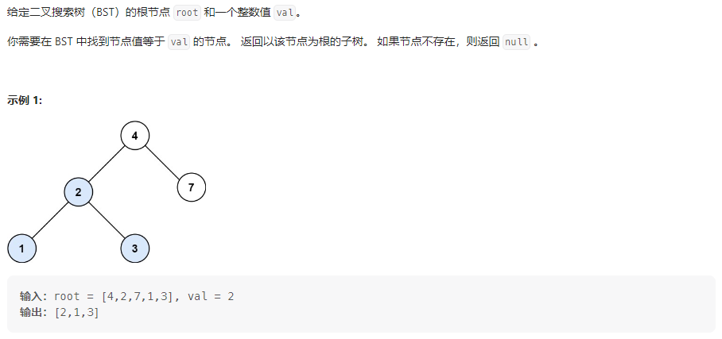
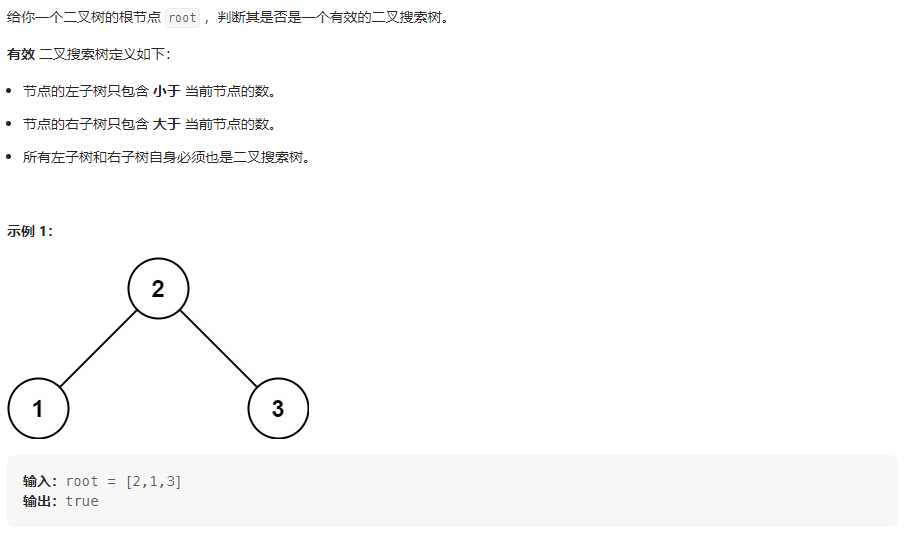
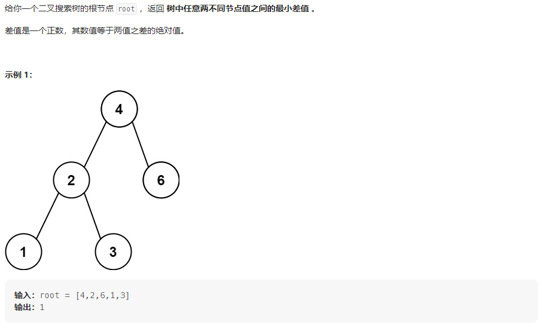
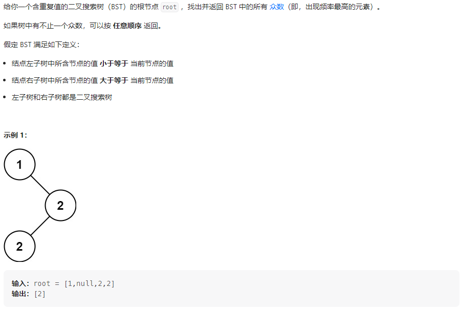

## 题目汇总

| 题目                                                         | 题解                                                         |
| ------------------------------------------------------------ | ------------------------------------------------------------ |
| [700.二叉搜索树中的搜索](https://leetcode.cn/problems/search-in-a-binary-search-tree/) | https://leetcode.cn/problems/search-in-a-binary-search-tree/solutions/2295076/di-gui-die-dai-cha-zhao-bstde-zhi-shi-ji-mz2m/ |
| [98.验证二叉搜索树](https://leetcode.cn/problems/validate-binary-search-tree/) | https://leetcode.cn/problems/validate-binary-search-tree/solutions/2295125/si-chong-fang-fa-yan-zheng-bstshu-shi-ji-mycw/ |
| [530.二叉搜索树的最小绝对差](https://leetcode.cn/problems/minimum-absolute-difference-in-bst/) | https://leetcode.cn/problems/minimum-absolute-difference-in-bst/solutions/2295161/li-yong-bstde-you-xu-xing-jie-jue-wen-ti-29jl/ |
| [501.二叉搜索树中的众数](https://leetcode.cn/problems/find-mode-in-binary-search-tree/) | https://leetcode.cn/problems/find-mode-in-binary-search-tree/solutions/2298603/li-yong-bstyou-xu-xing-yi-ci-bian-li-cha-o0ox/ |

<!-- more -->

## 700.二叉搜索树中的搜索

### 题目描述



### 我的思路

利用BST的性质

- 左子树的值都小于根节点
- 右子树的值都大于根节点
- 它的左右子树也分别为二叉搜索树

### 我的代码

#### 递归法

```java
class Solution {
    // 从BST中查找一个树
    // 若根节点值大于目标值，则从左子树中查找
    // 若根节点值小于目标值，则从右子树中查找
    public TreeNode searchBST(TreeNode root, int val) {
        if (root == null || root.val == val)
            return root;
        if (root.val > val)
            return searchBST(root.left, val);
        else if (root.val < val)
            return searchBST(root.right, val);
        return null;
    }
}
```

#### 迭代法

```java
class Solution {
    // 从BST中查找一个树
    // 若根节点值大于目标值，则从左子树中查找
    // 若根节点值小于目标值，则从右子树中查找
    public TreeNode searchBST(TreeNode root, int val) {
        while (root != null) {
            if (root.val > val)
                root = root.left;
            else if (root.val < val)
                root = root.right;
            else
                return root;
        }
        return null;
    }
}
```

## 98.验证二叉搜索树

### 题目描述



### 我的思路

#### 方法一

利用BST树的性质，按照中序遍历的节点值是有序的。可以先用中序遍历读取树的节点序列，比较下这个序列是不是有序的。

#### 方法二

利用BST的三个条件

1. 左子树所有数都小于根节点值，右子树所有数都大于根节点值；
2. 左子树为BST树；
3. 右子树为BST树；

这里使用前序，中序和后序都可以。每种遍历方式的时间复杂度都是O(N)。

#### 方法三

在方法一的基础上不需要存储所有节点的序列，而是在中序遍历的同时判断root.val是否大于上一个节点值，所以这里需要一个遍历记录上一个节点值pre。

### 我的代码

#### 方法一

```java
class Solution {
    // 若二叉树的节点按照中序遍历的结果是单调递增的，则为二叉树
    void inorder(TreeNode root, List<Integer> ans) {
        if (root == null)
            return;
        inorder(root.left, ans);
        ans.add(root.val);
        inorder(root.right, ans);
    }

    public boolean isValidBST(TreeNode root) {
        List<Integer> ans = new ArrayList<>();
        inorder(root, ans);
        Integer[] nums = ans.toArray(new Integer[ans.size()]);
        for (int i = 1; i < nums.length; i++) {
            if (nums[i] <= nums[i - 1])
                return false;
        }
        return true;
    }
}
```

#### 方法二

```java
class Solution {
    // 有效的二叉搜索树
    // 1、左子树为二叉搜索树
    // 2、右子树为二叉搜索树
    // 3、左子树的最大值小于根节点，右子树的最小值大于根节点
    public boolean isValidBST(TreeNode root) {
        if (root == null)
            return true;
        boolean left_valid = isValidBST(root.left);
        if (!left_valid)
            return false;
        boolean right_valid = isValidBST(root.right);
        if (!right_valid)
            return false;
        // 求左子树最大值和右子树最小值
        long left_max = Long.MIN_VALUE, right_min = Long.MAX_VALUE;
        TreeNode node = root.left;
        while (node != null) {
            left_max = node.val;
            node = node.right;
        }
        node = root.right;
        while (node != null) {
            right_min = node.val;
            node = node.left;
        }
        return left_max < root.val && right_min > root.val;
    }
}
```

#### 方法三

预定义一个最小值Long.MIN_VALUE

```java
class Solution {
    long pre = Long.MIN_VALUE;

    // 中序遍历
    public boolean isValidBST(TreeNode root) {
        // 终止条件
        if (root == null)
            return true;
        // 单层逻辑
        if (!isValidBST(root.left))
            return false;
        if (pre >= root.val)
            return false;
        pre = root.val;
        return isValidBST(root.right);
    }
}
```

将最左边节点赋给为pre

```java
class Solution {
    TreeNode pre = null;

    // 中序遍历
    public boolean isValidBST(TreeNode root) {
        // 终止条件
        if (root == null)
            return true;
        // 单层逻辑
        if (!isValidBST(root.left))
            return false;
        // 当pre为null时，说明root为最左边节点，直接赋给pre
        if (pre != null && pre.val >= root.val)
            return false;
        pre = root;
        return isValidBST(root.right);
    }
}
```

#### 迭代法

```java
class Solution {
    // 中序遍历
    public boolean isValidBST(TreeNode root) {
        LinkedList<TreeNode> stack = new LinkedList<>();
        TreeNode pre = null, cur = root;
        while (cur != null || !stack.isEmpty()) {
            if (cur != null) {
                // cur不空，向左子树移动
                stack.push(cur);
                cur = cur.left;
            } else {
                // cur空，处理栈顶元素
                cur = stack.pop();
                if (pre != null && pre.val >= cur.val)
                    return false;
                pre = cur;
                // cur向右子树移动
                cur = cur.right;
            }
        }
        return true;
    }
}
```

## 530.二叉搜索树的最小绝对差

### 题目描述



### 我的思路

#### 方法一

这题思路与[98.验证二叉搜索树](https://leetcode.cn/problems/validate-binary-search-tree/)差不多，单层逻辑中都需要计算左子树的最大值和右子树的最小值

利用BST的性质可以规避比较任意两节点

- 对于BST树来说，最小绝对差为(根节点值-左子树最大值)和(右子树最大值-根节点值)二者较小的那个值ans;
- 计算左子树中最小绝对差与ans比较;
- 计算右子树中最下绝对差与ans比较;

#### 方法二

类比[题解](https://leetcode.cn/problems/validate-binary-search-tree/solutions/2295125/si-chong-fang-fa-yan-zheng-bstshu-shi-ji-mycw/)中的**方法三**，在中序遍历的过程中，记录上一个节点，然后每次计算当前节点与上一节点的差值。

### 我的代码

#### 方法一

```java
class Solution {
    final int MAX = 100100;
    final int MIN = -1;

    // BST中任意两节点之间的最小差值：
    // 子问题：左子树最小差值left_ans，右子树最小差值right_ans
    // 当前根节点最小差值ans
    // ans = min(根节点-左子树的最大值，右子树的最小值-根节点)
    // 返回三者最小值
    public int getMinimumDifference(TreeNode root) {
        // 终止条件为叶子节点
        if (root.left == null && root.right == null)
            return MAX;
        int left_ans = MAX, right_ans = MAX;// 记录左右子树任意节点的最小差值
        int left_max = MIN, right_min = MAX;// 记录左子树最大值和右子树最小值
        int ans = MAX;// 记录根节点与左右子树所有节点的最小差值
        // 计算左子树的结果和左子树最大值
        TreeNode node;
        if (root.left != null) {
            left_ans = getMinimumDifference(root.left);
            node = root.left;
            while (node != null) {
                left_max = node.val;
                node = node.right;
            }
            ans = Math.min(ans, root.val - left_max);
        }
        // 计算右子树的结果和右子树最小值
        if (root.right != null) {
            right_ans = getMinimumDifference(root.right);
            node = root.right;
            while (node != null) {
                right_min = node.val;
                node = node.left;
            }
            ans = Math.min(ans, right_min - root.val);
        }
        int lrmin = Math.min(left_ans, right_ans);
        return ans == MAX ? lrmin : Math.min(ans, lrmin);
    }
}
```

#### 方法二

```java
class Solution {
    int ans = 100100;
    TreeNode pre = null;

    // 中序遍历
    public int getMinimumDifference(TreeNode root) {
        // 终止条件
        if (root == null)
            return ans;
        // 单层逻辑
        // 处理左子树
        getMinimumDifference(root.left);
        // 处理根节点
        if (pre != null)
            ans = Math.min(ans, root.val - pre.val);
        pre = root;
        // 处理右子树
        getMinimumDifference(root.right);
        return ans;
    }
```

#### 迭代法

```java
class Solution {

    // 迭代遍历
    public int getMinimumDifference(TreeNode root) {
        int ans = Integer.MAX_VALUE;
        LinkedList<TreeNode> stack = new LinkedList<>();
        TreeNode pre = null, cur = root;
        while (cur != null || !stack.isEmpty()) {
            if (cur != null) {
                stack.push(cur);
                // cur向左子树移动
                cur = cur.left;
            } else {
                cur = stack.pop();
                // 处理cur节点
                if (pre != null)
                    ans = Math.min(ans, cur.val - pre.val);
                pre = cur;
                // cur向右子树移动
                cur = cur.right;
            }
        }
        return ans;
    }
}
```

## 501.二叉搜索树中的众数

### 题目描述



### 我的思路

类比[题解](https://leetcode.cn/problems/validate-binary-search-tree/solutions/2295125/si-chong-fang-fa-yan-zheng-bstshu-shi-ji-mycw/)中的**方法三**，利用BST树的有序性，含重复值的BST中序遍历后相同元素相邻，则通过判断root与pre的值是否相等来记录val的次数count。处理完中间节点后，将count与最大次数max进行比较，若count==max，则直接加入答案，若count>max，更新max，清空答案，并加入新的答案。(处理完中间节点要记得更新pre的值)

### 我的代码

#### 中序法

```java
class Solution {
    TreeNode pre = null;// pre记录上一个节点
    int count = 0;// 记录val出现的次数
    int max = 0;// 记录频率最高的次数

    // 中序遍历root
    void inorder(TreeNode root, List<Integer> ans) {
        // 终止条件
        if (root == null)
            return;
        // 单层逻辑
        inorder(root.left, ans);
        // 处理根节点
        if (pre != null && root.val == pre.val) {
            count++;
        } else// pre为空或者pre与root值不等
            count = 1;
        pre = root;
        // 处理结果
        if (count == max)
            ans.add(root.val);
        else if (count > max) {
            max = count;
            ans.clear();
            ans.add(root.val);
        }
        inorder(root.right, ans);
    }

    public int[] findMode(TreeNode root) {
        List<Integer> ans = new ArrayList<>();
        inorder(root, ans);
        int[] res = new int[ans.size()];
        int i = 0;
        for (int elem : ans) {
            res[i++] = elem;
        }
        return res;
    }
}
```

#### 迭代法

```java
class Solution {
    // 迭代法
    public int[] findMode(TreeNode root) {
        List<Integer> ans = new ArrayList<>();
        TreeNode cur = root, pre = null;
        LinkedList<TreeNode> stack = new LinkedList<>();
        int count = 0, max = 0;
        while (cur != null || !stack.isEmpty()) {
            if (cur != null) {
                stack.push(cur);
                cur = cur.left;
            } else {
                cur = stack.pop();
                // 处理根节点
                if (pre != null && root.val == pre.val) {
                    count++;
                } else// pre为空或者pre与root值不等
                    count = 1;
                pre = root;
                // 处理结果
                if (count == max)
                    ans.add(root.val);
                else if (count > max) {
                    max = count;
                    ans.clear();
                    ans.add(root.val);
                }
                cur = cur.right;
            }
        }
        int[] res = new int[ans.size()];
        int i = 0;
        for (int elem : ans) {
            res[i++] = elem;
        }
        return res;
    }
}
```
