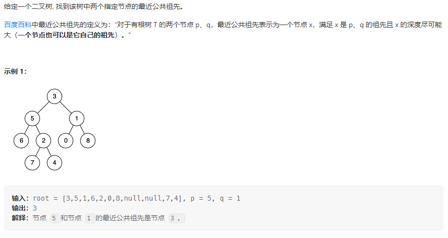
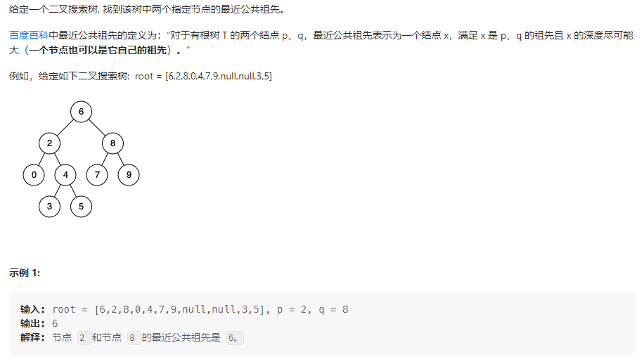

## 题目汇总

| 题目                                                         | 题解                                                         |
| ------------------------------------------------------------ | ------------------------------------------------------------ |
| [236. 二叉树的最近公共祖先](https://leetcode.cn/problems/lowest-common-ancestor-of-a-binary-tree/) | https://leetcode.cn/problems/lowest-common-ancestor-of-a-binary-tree/solutions/2303133/hou-xu-bian-li-hui-su-shi-jian-fu-za-du-x54ok/ |
| [235. 二叉搜索树的最近公共祖先](https://leetcode.cn/problems/lowest-common-ancestor-of-a-binary-search-tree/) | https://leetcode.cn/problems/lowest-common-ancestor-of-a-binary-search-tree/solutions/2306710/li-yong-bstde-you-xu-xing-shi-yong-zhong-me9y/ |

<!-- more -->

## 236. 二叉树的最近公共祖先

### 题目描述



### 我的思路

想要查找两节点的最近公共祖先，可见暴力的方法是从下向上枚举，所以需要使用回溯的方法查找两节点的最近公共祖先，而树的后序遍历就是一种回溯的方法，接下来考虑如何使用后序遍历。

先考虑能够成为公共祖先的有哪些情况：

**情况一：** p和q分别分布在root的左右子树中

**情况二：** p和q有一个位于根节点root，另一个位于root子树中

下面考虑递归函数四部曲

- 函数的定义

  > 查找树root中节点p或者节点q的位置或者p和q的最近公共祖先，若查找到p或q，则返回p，q位置；若查找到p和q的公共祖先，则返回他们公共祖先的位置；若上述都没有找到，则返回null。
  >
  > 后序遍历下，p和q一定比公共祖先先找到，而最先找到的公共祖先一定是最近公共祖先。

- 函数的输入输出

  > 输入为root，p，q
  >
  > 输出为p，q的位置或者p，q的最近公共祖先

- 终止条件

  > root为空时，返回空
  >
  > root等于p或q时，返回p或q的位置

- 单个节点的处理逻辑

  > 由于是后序遍历，所以先遍历左右子树，然后在处理中间节点
  >
  > 左右子树遍历完后，需要用两个变量left和right接受函数的返回结果，接下来就需要根据函数的返回结果来处理中间节点的逻辑
  >
  > 1、left和right都不为空时，说明p和q分布在左右子树中，那么root为最近公共祖先，返回root
  >
  > 2、left为空时，说明左子树没有公共祖先和p，q节点，返回右子树查找结果
  >
  > 3、right为空时，说明右子树没有公共祖先和p，q节点，返回左子树查找结果
  >
  > 4、left和right都为空时，说明左右子树都没有公共祖先和p，q节点，返回null(由于该逻辑包含在情况2和3中所以无需单独处理)
  >
  > 说明：根据单层处理逻辑来看，最近公共祖先只有一个节点，在最近公共祖先查找到之前，会出现情况1，而当公共祖先查找到之后剩余未访问的节点只会处理情况1、2的逻辑，所以查找到的最近公共祖先会不断地向根节点返回，最终的处理结果就是答案。

### 我的代码

```java
class Solution {

    public TreeNode lowestCommonAncestor(TreeNode root, TreeNode p, TreeNode q) {
        // 终止条件，先序
        if(root == null || root == q || root == p) return root;
        // 解决子问题
        TreeNode left = lowestCommonAncestor(root.left, p, q);
        TreeNode right = lowestCommonAncestor(root.right, p, q);
        // 回溯
        if(left == null) return right;
        if(right == null) return left;
        return root;
    }
}
```

## 235. 二叉搜索树的最近公共祖先

### 题目描述



### 我的思路

这题可以完全照搬[236. 二叉树的最近公共祖先](https://leetcode.cn/problems/lowest-common-ancestor-of-a-binary-tree/)的代码，但是没有利用上BST的有序性，考虑在BST下两节点公共祖先的性质，公共祖先的节点值一定是位于两节点值的区间内的。


那么p、q的中间节点中，哪一个节点才是祖先节点呢？答案是使用中序遍历第一个遍历到值位于p和q之间的节点就是祖先节点。如上图所示，查找0和5的公共祖先，第一个中间节点是2，在往后遍历无论是向左遍历还是向右遍历都会错过一个节点的祖先。代码可以照搬中序遍历的框架，第一次遇到p和q的中间节点返回结果答案。

### 我的代码

#### 递归法

```java
class Solution {
    // 递归
    public TreeNode lowestCommonAncestor(TreeNode root, TreeNode p, TreeNode q) {
        if (root.val > p.val && root.val > q.val)
            return lowestCommonAncestor(root.left, p, q);
        if (root.val < p.val && root.val < q.val)
            return lowestCommonAncestor(root.right, p, q);
        return root;
    }
}
```

#### 迭代法

```java
class Solution {
    // 迭代
    public TreeNode lowestCommonAncestor(TreeNode root, TreeNode p, TreeNode q) {
        while (root != null) {
            if (root.val > p.val && root.val > q.val)
                root = root.left;
            else if (root.val < p.val && root.val < q.val)
                root = root.right;
            else
                return root;
        }
        return null;
    }
}
```

