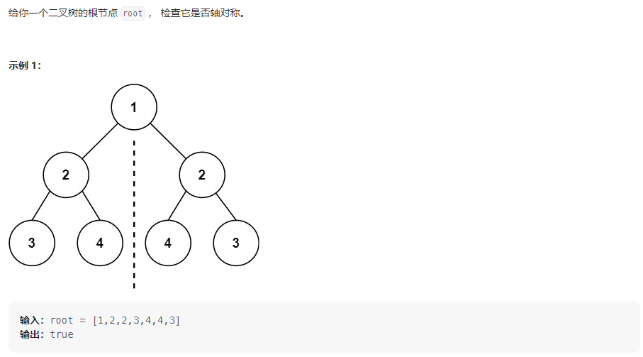
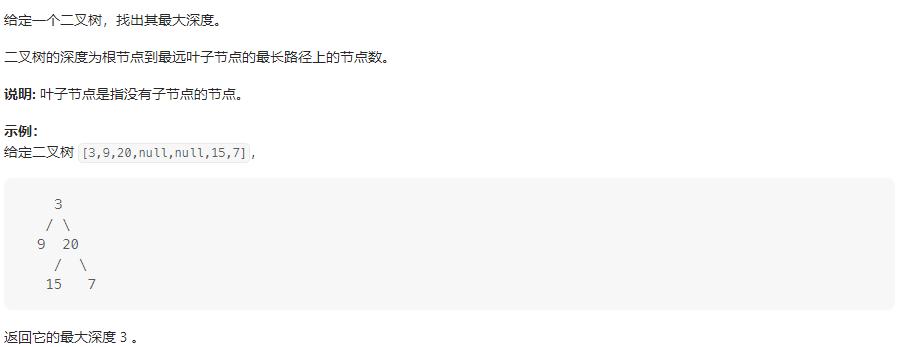
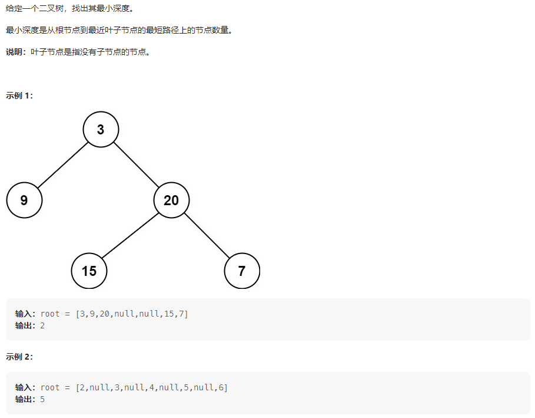
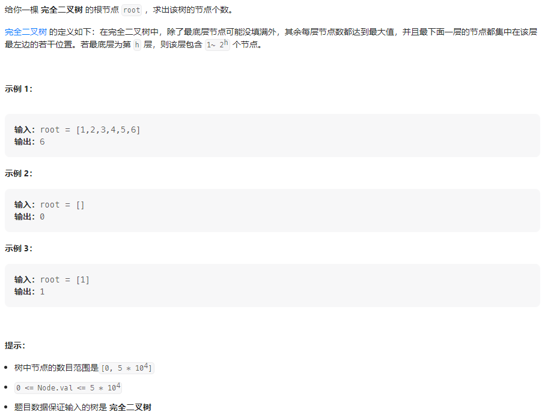
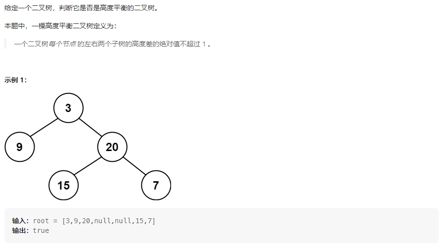
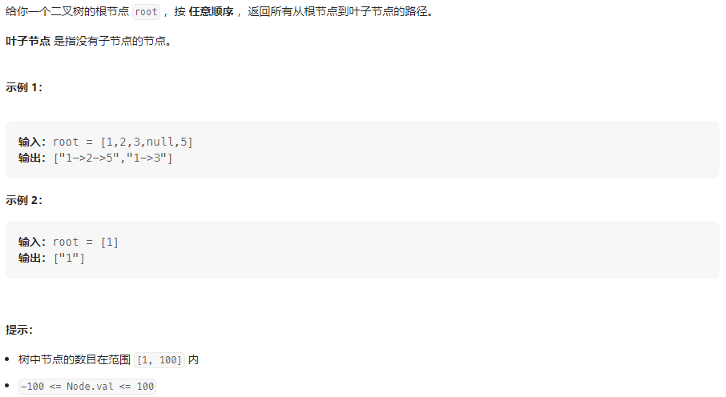
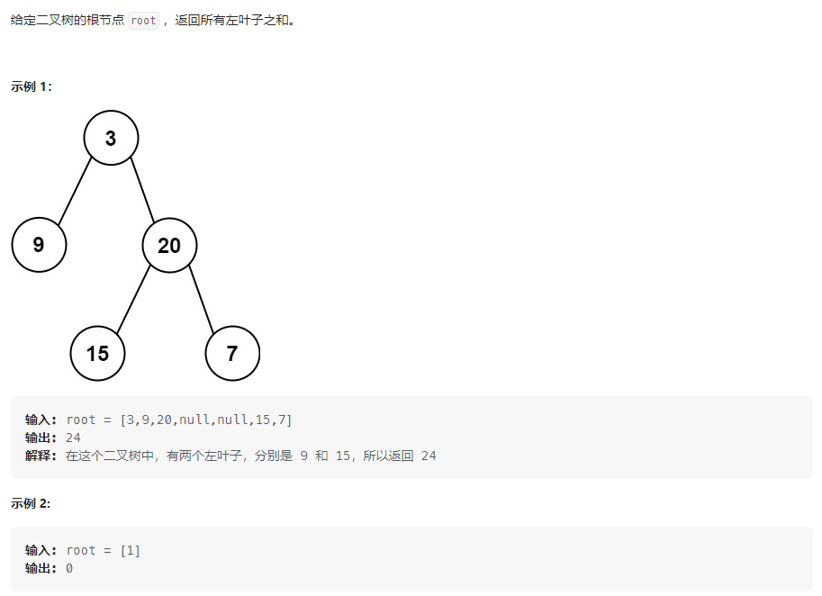
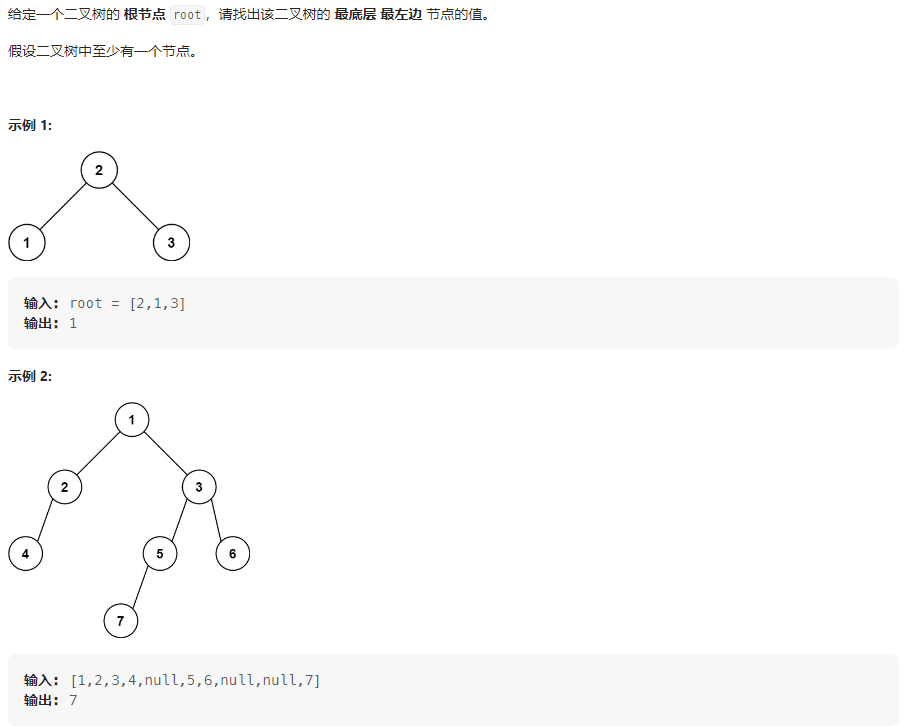
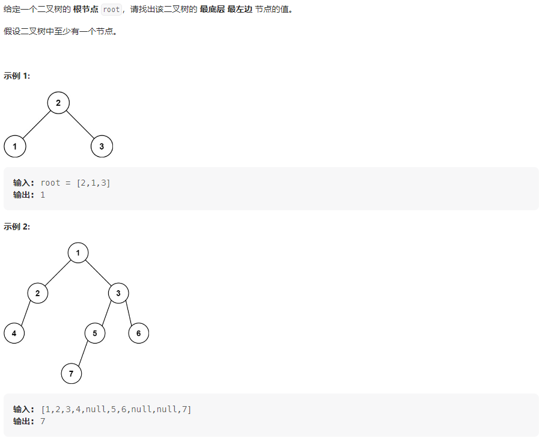

## 题目汇总

| 题目                                                         | 题解                                                         |
| ------------------------------------------------------------ | ------------------------------------------------------------ |
| [101. 对称二叉树](https://leetcode.cn/problems/symmetric-tree/) | https://leetcode.cn/problems/symmetric-tree/solutions/2291747/san-chong-fang-fa-jie-jue-shi-jian-fu-za-0xas/ |
| [104.二叉树的最大深度](https://leetcode.cn/problems/maximum-depth-of-binary-tree/) | https://leetcode.cn/problems/maximum-depth-of-binary-tree/solutions/2292856/san-chong-fang-fa-qiu-zui-da-shen-du-shi-9dw9/ |
| [111.二叉树的最小深度](https://leetcode.cn/problems/minimum-depth-of-binary-tree/) | https://leetcode.cn/problems/minimum-depth-of-binary-tree/solutions/2313324/qian-xu-hou-xu-die-dai-san-chong-fang-fa-e5gg/ |
| [222.完全二叉树的节点个数](https://leetcode.cn/problems/count-complete-tree-nodes/) | https://leetcode.cn/problems/count-complete-tree-nodes/solutions/2313340/li-yong-wan-quan-er-cha-shu-de-xing-zhi-qd5q2/ |
| [110.平衡二叉树](https://leetcode.cn/problems/balanced-binary-tree/) | https://leetcode.cn/problems/balanced-binary-tree/solutions/2313351/hou-xu-bian-li-ji-suan-shu-de-shen-du-sh-f18p/ |
| [257.二叉树的所有路径](https://leetcode.cn/problems/binary-tree-paths/) | https://leetcode.cn/problems/binary-tree-paths/solutions/2329292/qian-xu-bian-li-shi-jian-1ms-by-dpbirder-5h9z/ |
| [404.左叶子之和](https://leetcode.cn/problems/sum-of-left-leaves/) | https://leetcode.cn/problems/sum-of-left-leaves/solutions/2313383/li-yong-fu-jie-dian-pan-duan-shi-fou-wei-fu0t/ |
| [513.找树左下角的值](https://leetcode.cn/problems/find-bottom-left-tree-value/) |                                                              |
| [112.路径总和](https://leetcode.cn/problems/path-sum/)       |                                                              |
| [113.路径总和II](https://leetcode.cn/problems/path-sum-ii/)  |                                                              |
| 二叉树的修改与改造                                           |                                                              |
| [226.翻转二叉树](https://leetcode.cn/problems/invert-binary-tree/) |                                                              |
| [106.从中序与后序遍历序列构造二叉树](https://leetcode.cn/problems/construct-binary-tree-from-inorder-and-postorder-traversal/) |                                                              |

<!-- more -->

## 101.对称二叉树

### 题目描述



### 我的思路

这题要求判断root是否是对称二叉树，也就是判断root的左右子树是否是相互反转的。所以需要新定义一个函数用于判断左右子树是否是相互反转的。

判断两棵树是否是相互反转的需要满足如下三个条件：

- 二者根节点相同(条件1)
- 两棵树的外侧节点值相同(条件2)
- 两棵树的内侧节点值相同(条件3)

**递归法：** 考虑递归三部曲(学习自代码随想录)

1、递归函数的输入和输出是什么？

> 由于函数需要判断左右子树的外侧和内侧是否相同，所以输入应该是左右子树left和right，输出应该是boolean值

2、递归函数的终止条件是什么？

> 当左右子树都为空时，说明两子树相同，返回true

3、单层逻辑

> 当左右子树有一个不为空，说明两子树结构不同，返回false
>
> 当左右子树都不空，但左右子树的节点值不同，不满足条件1，返回false
>
> 当左右子树都不空，左右子树的节点值相同，继续判断左右子树孩子的外侧和内测是否是相互反转的，若是，条件满足，返回true，反之返回false

**迭代法**

由递归法可以看出，每次比较的两个节点为root左右子树的两个节点，所以每次处理都应该是这样一对节点。在遍历树的过程中只需要满足上述要求，无论哪种遍历方式都可以。每次只是需要一个容器来存储每次遍历的节点，对于深度优先遍历来说，容器是栈，对于广度优先遍历来说，容器是队列，即使是使用数组也可以满足要求。

在遍历的过程中只有所有的节点对满足上述三个条件才能保证是对称二叉树

**算法过程**

- 维护一个容器栈(由于这里需要判断树的结构，所以null也要入栈，这里使用LinkedList模拟栈)
- root的左右孩子入栈
- 若栈不空
  - left = 栈顶元素，出栈
  - right = 栈顶元素，出栈
  - 比较上述三个条件
  - 若有一个不满足，返回false
  - 若全部满足，left和right外侧元素入栈，left和right内侧元素入栈
  - 继续遍历
- 循环结束，返回true

### 我的代码

**递归法**

```java
class Solution {
    // 比较left和right是否是相互反转的
    boolean compare(TreeNode left, TreeNode right) {
        // 终止条件
        if (left == null && right == null)
            return true;
        // 单层逻辑
        if (left == null || right == null || left.val != right.val)
            return false;// 结构不同或者条件1不满足
        // 返回条件1和条件2的结果
        return compare(left.left, right.right) && compare(left.right, right.left);
    }

    public boolean isSymmetric(TreeNode root) {
        return compare(root.left, root.right);
    }
}
```

**使用栈**

```java
class Solution {
    public boolean isSymmetric(TreeNode root) {
        LinkedList<TreeNode> stack = new LinkedList<>();
        stack.push(root.right);
        stack.push(root.left);
        while (!stack.isEmpty()) {
            TreeNode left = stack.pop();
            TreeNode right = stack.pop();
            // 条件1,满足
            if (left == null && right == null)
                continue;
            // 二者结构不同或者值不同
            if (left == null || right == null || left.val != right.val)
                return false;
            // 继续判断条件2和3
            stack.push(right.right);
            stack.push(left.left);
            stack.push(right.left);
            stack.push(left.right);
        }
        return true;
    }
}
```

**使用队列**

```java
class Solution {
    public boolean isSymmetric(TreeNode root) {
        LinkedList<TreeNode> queue = new LinkedList<>();
        queue.add(root.right);
        queue.add(root.left);
        while (!queue.isEmpty()) {
            TreeNode left = queue.poll();
            TreeNode right = queue.poll();
            // 条件1,满足
            if (left == null && right == null)
                continue;
            // 二者结构不同或者值不同
            if (left == null || right == null || left.val != right.val)
                return false;
            // 继续判断条件2和3
            queue.add(right.right);
            queue.add(left.left);
            queue.add(right.left);
            queue.add(left.right);
        }
        return true;
    }
}
```

## 104.二叉树的最大深度

### 题目描述



### 我的思路

**深度：** 从根节点到当前节点简单路径上的节点数或者边数，计算深度使用前序遍历

**高度：** 从当前节点到叶子节点简单路径上的节点数或者变数，计算高度使用后序遍历

#### 前序遍历

先判断根节点是否为空，若空则返回结果，若不空，则更新最大深度，并处理左右子树。

1、递归函数的输入输出是什么

> 因为要计算树的深度，而当前节点的深度等于上一层的深度+1，所以深度应该传入左右子树

```java
void getdepth(TreeNode root, int height);
```

2、终止条件

```java
if(root == null) return;
```

3、单层逻辑

```java
ans = max(ans,height);
getdepth(root.left, height+1);
getdepth(root.right, height+1);
```

#### 后序遍历

题目要求的是树的最大深度，将原问题看成若干个子问题，则子问题为左子树最大深度和右子树最大深度中的最大值+1，即$f(root)=max(f(root.left),f(root.right))+1$。

**迭代法**

使用层序遍历，按层遍历，每次遍历时记录层数并更新答案

### 我的代码

#### 前序遍历

```java
class Solution {
    int ans = 0;

    void getdepth(TreeNode root, int height) {
        if (root == null)
            return;
        ans = Math.max(ans, height);
        getdepth(root.left, height + 1);
        getdepth(root.right, height + 1);
    }

    public int maxDepth(TreeNode root) {
        getdepth(root, 1);
        return ans;
    }
}
```

#### 后序遍历

```java
class Solution {
    // 返回左右子树深度最大值+1
    public int maxDepth(TreeNode root) {
        if (root == null)
            return 0;
        int left_depth = maxDepth(root.left);
        int right_depth = maxDepth(root.right);
        return Math.max(left_depth, right_depth) + 1;
    }
}
```

**层序遍历**

```java
class Solution {
    // 层序遍历
    public int maxDepth(TreeNode root) {
        LinkedList<TreeNode> q = new LinkedList();
        if (root != null)
            q.add(root);
        int depth = 0;
        while (!q.isEmpty()) {
            int size = q.size();
            depth++;
            for (int i = 0; i < size; i++) {
                TreeNode node = q.poll();
                if (node.left != null)
                    q.add(node.left);
                if (node.right != null)
                    q.add(node.right);
            }
        }
        return depth;
    }
}
```

## 111.二叉树的最小深度

### 题目描述



### 我的思路

本题的思路与[104.二叉树的最大深度](https://leetcode.cn/problems/maximum-depth-of-binary-tree/)类似，都需要计算树的深度或者高度，有如下几种思路

#### 后序法，计算高度

**函数定义**

```java
int minDepth(TreeNode root)// 计算root的最小深度，返回值为root的深度
```

**终止条件：** root为空时，返回0

**节点逻辑：**

计算左右子树的最小高度left和right，根据题目描述最小深度为根节点到叶子节点的节点数，则当左右子树深度为0时不够成最小深度。那么当前节点的最小高度可分为如下两种情况

- 当left和right有一个为0时，ans = left + right + 1
- 当left和right都不为0时，ans = min(left, right) + 1

#### 前序法，计算深度

**函数定义**

```java
int ans = Integer.MAX_VALUE; // 记录最小深度
void getdepth(TreeNode root, int height)// 使用前序遍历，height为root的深度
```

**终止条件：** root为叶子节点是，说明height为树的一个深度，处理答案，并返回

> 注意：这里因为终止条件为root为叶子节点，所以要求root不能为空

**节点逻辑**

- 处理左子树的最小深度
- 处理右子树的最小深度

### 我的代码

#### 后序遍历

```java
class Solution {
    public int minDepth(TreeNode root) {
        if(root == null) return 0;
        int ml = minDepth(root.left);
        int mr = minDepth(root.right);
        return ml==0 || mr == 0? mr + ml +1:Math.min(ml,mr)+1;
    }
}
```

#### 前序遍历

```java
class Solution {
    int ans = Integer.MAX_VALUE;

    // 前序遍历
    void bfs(TreeNode root, int height) {
        // 终止条件
        if (root.left == null && root.right == null) {
            ans = Math.min(height, ans);
            return;
        }
        // 单层逻辑
        if (root.left != null)
            bfs(root.left, height + 1);
        if (root.right != null)
            bfs(root.right, height + 1);
    }

    public int minDepth(TreeNode root) {
        if (root == null)
            return 0;
        bfs(root, 1);
        return ans;
    }
}
```

#### 层序遍历

```java
class Solution {

    // 层序遍历
    public int minDepth(TreeNode root) {
        int height = 0;
        Deque<TreeNode> q = new ArrayDeque<>();
        if (root != null)
            q.add(root);
        while (!q.isEmpty()) {
            int size = q.size();
            TreeNode node;
            height++;
            for (int i = 0; i < size; i++) {
                node = q.poll();
                if (node.left == null && node.right == null)
                    return height;
                if (node.left != null)
                    q.add(node.left);
                if (node.right != null)
                    q.add(node.right);
            }
        }
        return height;
    }
}
```

## 222.完全二叉树的节点个数

### 题目描述



### 我的思路

不考虑完全二叉树的性质，那么可以使用前序，中序，后序，层序中的一种遍历完所有的节点，从而得到二叉树的节点数目。

考虑完全二叉树的性质，对于完全二叉树中的所有节点只有两种树，一种是完全二叉树，一种是满二叉树，而对于满二叉树就可以利用公式计算节点数目$2^{h}-1$，h为满二叉树的深度。

那么如何判断满二叉树呢？当树的最左边节点和最右边节点深度相同时，那么当前的子树为满二叉树，代码如下：

```java
// 计算最左边节点深度
int left = 0;
while (node != null) {
    left++;
    node = node.left;
}
// 计算最右边节点深度
int right = 0;
node = root.right;
while (node != null) {
    right++;
    node = node.right;
}
// root为满二叉树
if (left == right)
    return (2 << left) - 1;
```

### 我的代码

```java
class Solution {
    // 前序遍历
    public int countNodes(TreeNode root) {
        // 终止条件
        if (root == null)
            return 0;
        // 单层逻辑
        // 处理中间节点
        TreeNode node = root.left;
        // 计算最左边节点深度
        int left = 0;
        while (node != null) {
            left++;
            node = node.left;
        }
        // 计算最右边节点深度
        int right = 0;
        node = root.right;
        while (node != null) {
            right++;
            node = node.right;
        }
        // root为满二叉树
        if (left == right)
            return (2 << left) - 1;
        return countNodes(root.left) + countNodes(root.right) + 1;
    }
}
```

##  110.平衡二叉树

### 题目描述



### 我的思路

平衡二叉树的定义要求，左右子树均为平衡二叉树，且左子树的高度与右子树的高度差的绝对值不能超过1。所以这题需要判断root是否为平衡二叉树的同时，返回root的高度，由于判断root是否为平衡二叉树时需要用到root左右子树的高度，所以使用后序遍历的方法，计算高度可类似于[104.二叉树的最大深度](https://leetcode.cn/problems/maximum-depth-of-binary-tree/)的思路。

**函数定义**

```java
// -1: 当前树不平衡，否则返回当前树的高度
int getHeight(TreeNode root) 
```

**终止条件：** root为空时返回0

**节点逻辑**

- 计算左子树高度ml
- 计算右子树高度mr
- 若ml和mr中有一个值为-1，返回-1
- 判断ml与mr的绝对差值是否下于1
- 不小于1，返回-1
- 反之，返回max(ml, mr)+1

### 我的代码

```java
class Solution {

    // -1: root不平衡，反之返回root的高度
    int getHeight(TreeNode root) {
        // 终止条件
        if (root == null)
            return 0;
        // 单层逻辑，后续遍历
        int ml = getHeight(root.left);
        int mr = getHeight(root.right);
        if (ml == -1 || mr == -1 || Math.abs(ml - mr) > 1)
            return -1;
        return Math.max(ml, mr) + 1;
    }

    public boolean isBalanced(TreeNode root) {

        return getHeight(root) == -1 ? false : true;
    }
}
```

## 257.二叉树的所有路径

### 题目描述



### 我的思路

这里要计算从根节点到叶子节点的路径，所以需要使用前序遍历所有节点，且递归函数的终止条件为叶子节点。

**函数定义**

```java
// ans存储答案，path存储当前节点到根节点的路径
void preorder(TreeNode root, String path, List<String> ans)
```

**终止条件：** root为叶子节点，将path加入路径

**节点逻辑**

- 加入当前节点值
- 若左子树不空，处理左子树
- 若右子树不空，处理右子树

### 我的代码

#### 递归法

```java
class Solution {
    List<String> ans = new ArrayList();

    // 前序遍历
    void preorder(TreeNode root, String path) {
        StringBuffer sb = new StringBuffer(path);
        sb.append(Integer.toString(root.val));
        // 终止条件， 叶子节点
        if (root.left == null && root.right == null) {
            ans.add(sb.toString());
            return;
        }
        sb.append("->");
        // 处理左子树
        if (root.left != null)
            preorder(root.left, sb.toString());
        // 处理右子树
        if (root.right != null)
            preorder(root.right, sb.toString());
    }

    public List<String> binaryTreePaths(TreeNode root) {
        preorder(root, "");
        return ans;
    }
}
```

#### 迭代法

```java
class Solution {

    public List<String> binaryTreePaths(TreeNode root) {
        List<String> ans = new ArrayList();
        Deque<Object> stack = new ArrayDeque();
        stack.push(root);
        stack.push("");
        while (!stack.isEmpty()) {
            // 处理中间节点
            String path = (String) stack.pop();
            TreeNode node = (TreeNode) stack.pop();
            StringBuilder sb = new StringBuilder(path);
            sb.append(Integer.toString(node.val));
            if (node.left == null && node.right == null) {
                ans.add(sb.toString());
            }
            sb.append("->");
            if (node.right != null) {
                stack.push(node.right);
                stack.push(sb.toString());
            }
            if (node.left != null) {
                stack.push(node.left);
                stack.push(sb.toString());
            }
        }
        return ans;
    }
}
```

## 404.左叶子之和

### 题目描述



### 我的思路

原问题可以化为左子树左叶之和+右子树左叶子之和，那么遍历顺序为后序遍历，由于无法通过当前节点判断左节点，所以只能通过父节点判断左节点。

**函数定义**

```java
// 计算root左叶子节点和
int sumOfLeftLeaves(TreeNode root)
```

**终止条件：** root为空时，返回0

**节点逻辑**

- 取root的左子树left
- 若left不空且left为叶子节点，则left的值sum需要被计入答案
- 计算左子树的左叶子之和left_sum
- 计算右子树的左叶子之和right_sum
- 返回答案：left_sum + right_sum + sum

### 我的代码

#### 递归法

```java
class Solution {

    public int sumOfLeftLeaves(TreeNode root) {
        // 终止条件
        if(root == null) return 0;
        // 节点逻辑
        TreeNode left = root.left;
        int sum = 0;
        if(left!= null && left.left == null & left.right == null)
            sum = left.val;
        return sumOfLeftLeaves(left) + sumOfLeftLeaves(root.right ) + sum;
    }
}
```

#### 迭代法

```java
class Solution {

    // 迭代法，前序
    public int sumOfLeftLeaves(TreeNode root) {
        Deque<TreeNode> stack = new ArrayDeque();
        stack.push(root);
        int ans = 0;
        while (!stack.isEmpty()) {
            // 处理中间节点
            TreeNode node = stack.pop();
            if (node.left != null && node.left.left == null && node.left.right == null)
                ans += node.left.val;
            if (node.right != null)
                stack.push(node.right);
            if (node.left != null)
                stack.push(node.left);
        }
        return ans;
    }
}
```

## 513.找树左下角的值

### 题目描述



### 我的思路

#### 层序遍历

根据题目描述，使用层序遍历，最后一层的第一个节点就是答案节点，这里每层从右向左遍历，则最后一个节点就是答案节点。

#### 前序遍历

根据题目描述，使用前序遍历，深度最大的一层第一个遍历到的节点就是答案节点，考虑如下三个问题

**1、函数定义**

查找答案节点，height为当前节点所处的深度，若height大于最大深度，说明root是当前层第一个访问到的节点，更新ans，反之不做任何处理

```java
TreeNode ans = root;
int max_height = -1;
void getdepth(TreeNode root, int height);
```

**2、终止条件**

root == null

**3、节点逻辑**

- 若height > max_height，更新max_height和ans
- 处理左子树
- 处理右子树

### 我的代码

#### 层序遍历

```java
class Solution {
    public int findBottomLeftValue(TreeNode root) {
        // 数组模拟队列
        int hh = 0, tt = -1;
        TreeNode[] q = new TreeNode[10010];
        q[++tt] = root;
        TreeNode ans = null;
        while (hh <= tt) {
            ans = q[hh++];
            // 每一层从右向左遍历
            if (ans.right != null)
                q[++tt] = ans.right;
            if (ans.left != null)
                q[++tt] = ans.left;
        }
        return ans.val;
    }
}
```

#### 前序遍历

```java
class Solution {
    TreeNode ans = null;
    int max_height = 0;

    void getdepth(TreeNode root, int height) {
        // 终止条件
        if (root == null)
            return;
        // 节点逻辑
        if (height > max_height) {
            max_height = height;
            ans = root;
        }
        // 处理子节点
        getdepth(root.left, height + 1);
        getdepth(root.right, height + 1);
    }

    public int findBottomLeftValue(TreeNode root) {
        getdepth(root, 1);
        return ans.val;
    }
}
```

## 112.路径总和

### 题目描述



### 我的思路

根据题目要求寻找一条路径和为目标和的路径，路径问题一般都用前序遍历，考虑如下三个问题：

**1、函数定义**

判断root树中有无到叶子节点的路径和为目标和的路径，则原问题可以转化为root的子树中是否存在一条路径和为目标和-root.val的路径

```java
boolean hasPathSum(TreeNode root, int targetSum)
```

**2、终止条件**

root为叶子节点，若targetSum==0，返回true，反之返回false

**3、节点逻辑**

若左右子树中存在一条路径和为targetSum-root.val的路径，则返回true，反之返回false

### 我的代码

#### 递归法

```java
// 版本一
class Solution {

    // 判断root中是否有一条路径和为targetSum
    public boolean hasPathSum(TreeNode root, int targetSum) {
        // 终止条件
        if (root == null)
            return false;
        if (root.left == null && root.right == null)
            return targetSum == root.val;
        // 节点逻辑
        if (root.left != null) {
            if (hasPathSum(root.left, targetSum - root.val))
                return true;
        }
        if (root.right != null) {
            if (hasPathSum(root.right, targetSum - root.val))
                return true;
        }
        return false;
    }
}
// 版本二
class Solution {

    // 判断root中是否有一条路径和为targetSum
    public boolean hasPathSum(TreeNode root, int targetSum) {
        // 终止条件
        if (root == null)
            return false;
        if (root.left == null && root.right == null)
            return targetSum == root.val;
        return hasPathSum(root.left, targetSum - root.val) || hasPathSum(root.right, targetSum - root.val);
    }
}
```

#### 迭代法

```java
class Solution {

    // 判断root中是否有一条路径和为targetSum
    public boolean hasPathSum(TreeNode root, int targetSum) {
        Deque<Object> stack = new ArrayDeque<>();
        if (root != null) {
            stack.push(root);
            stack.push(targetSum - root.val);
        }
        while (!stack.isEmpty()) {
            // 处理父节点
            int sum = (int) stack.pop();
            TreeNode node = (TreeNode) stack.pop();
            if (node.left == null && node.right == null) {
                if (sum == 0)
                    return true;
            }
            // 处理子节点
            if (node.left != null) {
                stack.push(node.left);
                stack.push(sum - node.left.val);
            }
            if (node.right != null) {
                stack.push(node.right);
                stack.push(sum - node.right.val);
            }
        }
        return false;
    }
}
```

## 113.路径总和II

### 题目描述

### 我的思路

### 我的代码

#### 递归法

```java
class Solution {
    List<List<Integer>> ans = new ArrayList<>();

    void preorder(TreeNode root, LinkedList<Integer> path, int targetSum) {
        // 终止条件，叶子节点
        if (root.left == null && root.right == null) {
            if (targetSum == 0)
                ans.add(new ArrayList(path));
            return;
        }
        // 处理节点逻辑
        if (root.left != null) {
            path.add(root.left.val);
            preorder(root.left, path, targetSum - root.left.val);
            // 回溯
            path.removeLast();
        }
        if (root.right != null) {
            path.add(root.right.val);
            preorder(root.right, path, targetSum - root.right.val);
            path.removeLast();
        }
    }

    public List<List<Integer>> pathSum(TreeNode root, int targetSum) {
        LinkedList<Integer> path = new LinkedList<>();
        if (root != null) {
            path.add(root.val);
            preorder(root, path, targetSum - root.val);
        }
        return ans;
    }
}
```

#### 迭代法

```java
class Solution {
    public List<List<Integer>> pathSum(TreeNode root, int targetSum) {
        List<List<Integer>> ans = new ArrayList<>();
        LinkedList<Integer> path = new LinkedList<>();
        Deque<Object> stack = new ArrayDeque<>();
        if (root != null) {
            stack.push(root);
            stack.push(targetSum - root.val);
            path.add(root.val);
            stack.push(path);
        }
        while (!stack.isEmpty()) {
            // 处理父节点
            path = (LinkedList<Integer>) stack.pop();
            int sum = (int) stack.pop();
            TreeNode node = (TreeNode) stack.pop();
            if (node.left == null && node.right == null) {
                if (sum == 0)
                    ans.add(new ArrayList(path));
            }
            // 处理子节点
            if (node.right != null) {
                stack.push(node.right);
                stack.push(sum - node.right.val);
                LinkedList<Integer> _path = new LinkedList(path);
                _path.add(node.right.val);
                stack.push(_path);
            }
            if (node.left != null) {
                stack.push(node.left);
                stack.push(sum - node.left.val);
                LinkedList<Integer> _path = new LinkedList(path);
                _path.add(node.left.val);
                stack.push(_path);
            }
        }
        return ans;
    }
}
```

