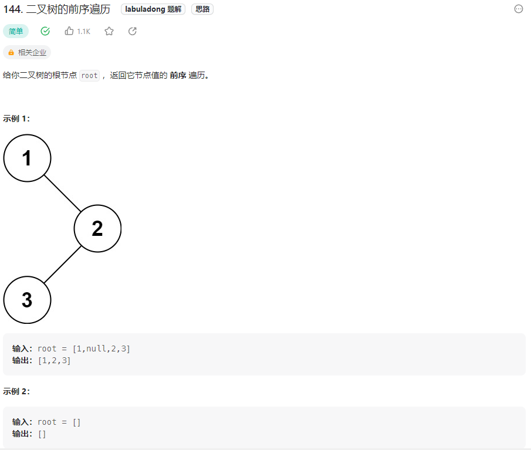

## 题目汇总

| 题目                                                         | 题解 |
| ------------------------------------------------------------ | ---- |
| [144.二叉树的前序遍历](https://leetcode.cn/problems/binary-tree-preorder-traversal/) |      |
| [94.二叉树的中序遍历](https://leetcode.cn/problems/binary-tree-inorder-traversal/) |      |
| [145.二叉树的后序遍历](https://leetcode.cn/problems/binary-tree-postorder-traversal/) |      |

<!-- more -->

## 二叉树的几种遍历方式

### 144.二叉树的前序遍历

#### 题目描述



#### 题解

##### 递归法

```java
class Solution {
    void preorder(TreeNode root, List<Integer> ans) {
        // 终止条件
        if (root == null)
            return;
        // 单层逻辑
        ans.add(root.val);
        // 遍历左子树
        preorder(root.left, ans);
        // 遍历右子树
        preorder(root.right, ans);
    }

    public List<Integer> preorderTraversal(TreeNode root) {
        ArrayList<Integer> ans = new ArrayList<>();
        preorder(root, ans);
        return ans;
    }
}
```

##### 迭代法


94.二叉树的中序遍历

145.二叉树的后序遍历