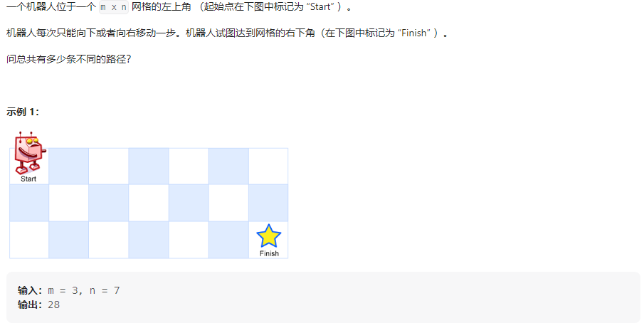
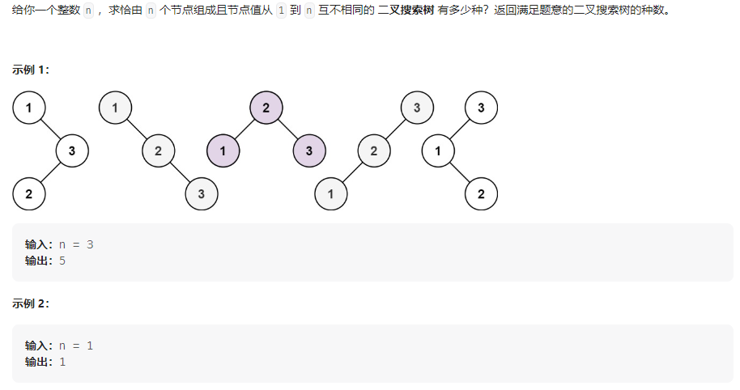
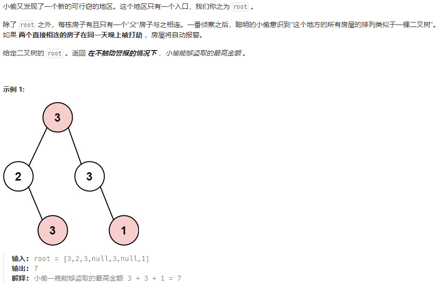

## 题目汇总

| 题目                                                         | 题解                                                         |
| ------------------------------------------------------------ | ------------------------------------------------------------ |
| [509. 斐波那契数](https://leetcode.cn/problems/fibonacci-number/) |                                                              |
| [70. 爬楼梯](https://leetcode.cn/problems/climbing-stairs/)  |                                                              |
| [746. 使用最小花费爬楼梯](https://leetcode.cn/problems/min-cost-climbing-stairs/) |                                                              |
| [62.不同路径](https://leetcode.cn/problems/unique-paths/)    | https://leetcode.cn/problems/unique-paths/solutions/2361753/dong-tai-gui-hua-shi-jian-fu-za-du-on2-b-jh8t/ |
| [343.整数拆分](https://leetcode.cn/problems/integer-break/)  |                                                              |
| [96.不同的二叉搜索树](https://leetcode.cn/problems/unique-binary-search-trees/) |                                                              |
| 打家劫舍专题                                                 |                                                              |
| [198.打家劫舍](https://leetcode.cn/problems/house-robber/)   |                                                              |
| [213.打家劫舍II](https://leetcode.cn/problems/house-robber-ii/) |                                                              |
| [337.打家劫舍 III](https://leetcode.cn/problems/house-robber-iii/)（树型dp） |                                                              |
| 买卖股票的最佳时间专题                                       |                                                              |
| [121.买卖股票的最佳时机](https://leetcode.cn/problems/best-time-to-buy-and-sell-stock/) |                                                              |
| [122.买卖股票的最佳时机II](https://leetcode.cn/problems/best-time-to-buy-and-sell-stock-ii/) |                                                              |
| [123.买卖股票的最佳时机III](https://leetcode.cn/problems/best-time-to-buy-and-sell-stock-iii/) |                                                              |
| [188.买卖股票的最佳时机IV](https://leetcode.cn/problems/best-time-to-buy-and-sell-stock-iv/) |                                                              |
| 不连续子序列问题                                             |                                                              |
| [300.最长递增子序列](https://leetcode.cn/problems/longest-increasing-subsequence/) |                                                              |
| [1143. 最长公共子序列](https://leetcode.cn/problems/longest-common-subsequence/) |                                                              |
| [1035.不相交的线](https://leetcode.cn/problems/uncrossed-lines/) |                                                              |
| 连续子序列问题                                               |                                                              |
| [674. 最长连续递增序列](https://leetcode.cn/problems/longest-continuous-increasing-subsequence/) |                                                              |
| [718. 最长重复子数组](https://leetcode.cn/problems/maximum-length-of-repeated-subarray/) |                                                              |
| [53. 最大子序和](https://leetcode.cn/problems/maximum-subarray/) |                                                              |
| 编辑距离                                                     |                                                              |
| [392. 判断子序列](https://leetcode.cn/problems/is-subsequence/) |                                                              |
| [115. 不同的子序列](https://leetcode.cn/problems/distinct-subsequences/) |                                                              |
| [583. 两个字符串的删除操作](https://leetcode.cn/problems/delete-operation-for-two-strings/) |                                                              |
| [72. 编辑距离](https://leetcode.cn/problems/edit-distance/)  |                                                              |
| 回文问题                                                     |                                                              |
| [647. 回文子串](https://leetcode.cn/problems/palindromic-substrings/) |                                                              |
| [516.最长回文子序列](https://leetcode.cn/problems/longest-palindromic-subsequence/) |                                                              |
|                                                              |                                                              |

<!-- more -->

## 509.斐波那契数

### 题目描述

### 我的思路

考虑动态规划五部曲：

1、dp数组的含义：dp[i]表示第i个斐波那契数

2、递推公式：dp[i] = dp[i-1] + dp[i-2]

3、状态初始化：dp[0] = 0, dp[1] = 1

4、遍历顺序：从前向后

5、模拟： 省略

### 我的代码

```java
class Solution {
    final int N = 35;

    public int fib(int n) {
        int[] dp = new int[N];
        dp[0] = 0;
        dp[1] = 1;
        for (int i = 2; i <= n; i++)
            dp[i] = dp[i - 1] + dp[i - 2];
        return dp[n];
    }
}
```

## 70.爬楼梯

### 题目描述


### 我的思路

见代码注释

**完全背包版**

### 我的代码

```java
class Solution {
    final int N = 50;

    public int climbStairs(int n) {
        // dp[i]:爬i层楼梯具有的不同种方法
        int[] dp = new int[N];
        // 状态方程：dp[i] = dp[i-1] + dp[i-2]
        // 初始化
        dp[1] = 1;
        dp[0] = 1;
        // 循环方向：从前向后
        for (int i = 2; i <= n; i++)
            dp[i] = dp[i - 1] + dp[i - 2];
        // System.out.println(Arrays.toString(dp));
        return dp[n];
    }
}
```

## 746.使用最小花费爬楼梯

### 题目描述

### 我的思路

### 我的代码

```java
class Solution {
    final int N = 1010;

    public int minCostClimbingStairs(int[] cost) {
        // dp[i]: 爬到第i个楼梯需要的最小代价
        int[] dp = new int[N];
        // 状态方程：dp[i] = min(dp[i-1] + cost[i-1], dp[i-2] + cost[i-2])
        // 初始化
        // dp[0] = 0;
        // dp[1] = 0;
        // 遍历方向：从前向后
        for (int i = 2; i <= cost.length; i++)
            dp[i] = Math.min(dp[i - 1] + cost[i - 1], dp[i - 2] + cost[i - 2]);
        return dp[cost.length];
    }
}
```

## 62.不同路径

### 题目描述



### 我的思路

见代码注释

### 我的代码

```java
class Solution {
    // 二维dp
    public int uniquePaths(int m, int n) {
        // dp[i,j]：机器人移动到[i,j]可能的路径数
        int[][] dp = new int[m + 5][n + 5];
        // 递推公式：dp[i][j] = dp[i-1][j] + dp[i][j-1]
        // 初始条件
        for (int i = 0; i < m; i++)
            dp[i][0] = 1;
        for (int j = 0; j < n; j++)
            dp[0][j] = 1;
        // 遍历顺序：从前向后
        for (int i = 1; i < m; i++) {
            for (int j = 1; j < n; j++) {
                dp[i][j] = dp[i - 1][j] + dp[i][j - 1];
            }
        }
        return dp[m - 1][n - 1];
    }
}
```

## 96.不同的二叉搜索树

### 题目描述



### 我的思路

### 我的代码

## 337.打家劫舍 III

### 题目描述



### 我的思路

### 我的代码
