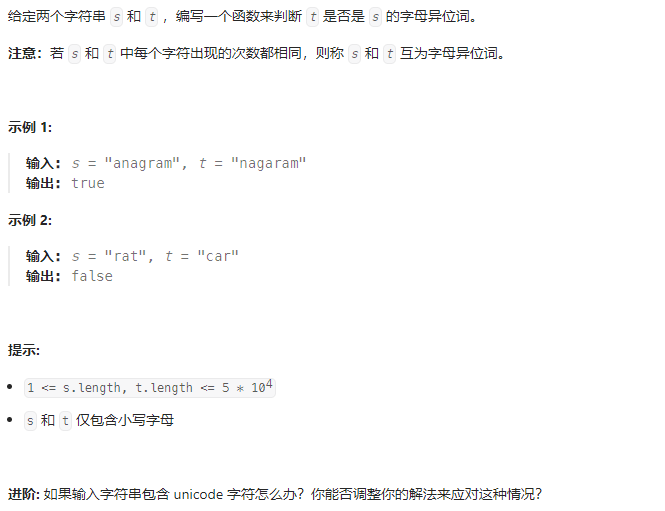
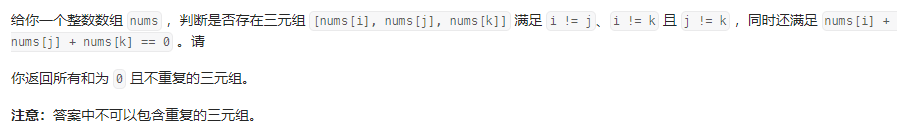

## 题目汇总

| 题目                                                         | 题解                                                         |
| ------------------------------------------------------------ | ------------------------------------------------------------ |
| [242.有效的字母异位词](https://leetcode.cn/problems/valid-anagram/) | https://leetcode.cn/problems/valid-anagram/solutions/2476675/ha-xi-biao-liang-ci-bian-li-by-dpbirder-ya3b/ |
| [349. 两个数组的交集](https://leetcode.cn/problems/intersection-of-two-arrays/) | ---                                                          |
| [202. 快乐数](https://leetcode.cn/problems/happy-number/)    | https://leetcode.cn/problems/happy-number/solutions/2262607/ha-xi-biao-shi-jian-1ms-by-dpbirder-4ynj/ |
| [1. 两数之和](https://leetcode.cn/problems/two-sum/)         |                                                              |
| [454.四数相加II](https://leetcode.cn/problems/4sum-ii/)      | https://leetcode.cn/problems/4sum-ii/solutions/2262627/shi-jian-fu-za-du-on2si-lu-jian-dan-dai-hexly/ |
| [383. 赎金信](https://leetcode.cn/problems/ransom-note/)     |                                                              |
| [15. 三数之和](https://leetcode.cn/problems/3sum/)           |                                                              |
|                                                              |                                                              |

<!-- more -->

## 242.有效的字母异位词

### 题目描述



### 我的思路

1. 使用哈希表map统计s中每个字符出现的次数
2. 枚举t中所有字符，字符出现一次从map中减去一次，若出现小于0的数，则返回false，否则返回true

### 我的代码

```java
class Solution {
    public boolean isAnagram(String s, String t) {
        if (s.length() != t.length())
            return false;
        int[] map = new int[30];
        for (char ch : s.toCharArray()) {
            map[ch - 'a']++;
        }
        for (char ch : t.toCharArray()) {
            map[ch - 'a']--;
            if (map[ch - 'a'] < 0)
                return false;
        }
        return true;
    }
}
```


## 202.快乐数

### 题目描述


### 题解

#### 我的思路

这题要求判断n是不是快乐数，当满足题目条件时为快乐数，若不为快乐数，则陷入无限循环，说明若n不为快乐数，则每位数字的平方和一定会重复出现，所以当每位数字的平方和重复出现时n不为快乐数。这里用一个集合记录每次n的每位数字的平方和，若平方和重复出现则n不是快乐数，反之是快乐数。

#### 我的代码

```java
class Solution {
    // 统计每个位置上的数字平方和
    int getNextSum(int n) {
        int ans = 0;
        while (n > 0) {
            ans += (n % 10) * (n % 10);
            n /= 10;
        }
        return ans;
    }

    public boolean isHappy(int n) {
        Set<Integer> set = new HashSet<>();
        int sum = getNextSum(n);
        while (sum != 1 && !set.contains(sum)) {
            set.add(sum);
            sum = getNextSum(sum);
        }
        return sum == 1;
    }
}
```

## 454.四数相加II

### 题目描述


### 题解

#### 我的思路

这题要求计算四数和为0的元组个数，可以考虑两数和，将nums1+nums2和nums3+nums4分别看成一组，使用哈希表记录nums1+nums2不同的和以及每个和出现的次数，在枚举nums3+nums4和的时候判断之前是否出现过他的负数，若出现过则满足要求加入答案，反之继续枚举。

#### 我的代码

```java
class Solution {
    public int fourSumCount(int[] nums1, int[] nums2, int[] nums3, int[] nums4) {
        int ans = 0;
        // key: nums1[i]+nums2[j]的和 value:出现的次数
        HashMap<Integer, Integer> map = new HashMap();

        for (int n1 : nums1)
            for (int n2 : nums2) {
                int sum = n1 + n2;
                map.put(sum, map.getOrDefault(sum, 0) + 1);
            }
        for (int n3 : nums3)
            for (int n4 : nums4)
                ans += map.getOrDefault(-(n3 + n4), 0);
        return ans;
    }
}
```

## 15.三数之和

### 题目描述



### 我的思路

### 我的代码
