## 题目汇总

| 题目                                                         | 题解                                                         |
| ------------------------------------------------------------ | ------------------------------------------------------------ |
| 组合问题                                                     | 收集状态树中所有的叶子节点                                   |
| [77.组合](https://leetcode.cn/problems/combinations/)        | https://leetcode.cn/problems/combinations/solutions/2332183/jian-zhi-you-hua-shi-jian-1ms-by-dpbirde-p6q8/ |
| [216.组合总和III](https://leetcode.cn/problems/combination-sum-iii/) |                                                              |
| [39. 组合总和](https://leetcode.cn/problems/combination-sum/) |                                                              |
| [40.组合总和II](https://leetcode.cn/problems/combination-sum-ii/) | https://leetcode.cn/problems/combination-sum-ii/solutions/2337184/hui-su-jian-zhi-qu-zhong-shi-jian-2ms-by-nwjs/ |
| 字符串分割问题                                               | 收集状态树中所有的叶子节点                                   |
| [131.分割回文串](https://leetcode.cn/problems/palindrome-partitioning/) | https://leetcode.cn/problems/palindrome-partitioning/solutions/2337113/hui-su-fa-fen-ge-zi-fu-chuan-shi-jian-fu-5e10/ |
| [93.复原IP地址](https://leetcode.cn/problems/restore-ip-addresses/) |                                                              |
| 子集问题                                                     | 收集状态树中所有的节点                                       |
| [78.子集](https://leetcode.cn/problems/subsets/)             | https://leetcode.cn/problems/subsets/solutions/2337153/hui-su-fa-qiu-zi-ji-shi-jian-fu-za-du-o2-nywf/ |
| [90.子集II](https://leetcode.cn/problems/subsets-ii/)        | https://leetcode.cn/problems/subsets-ii/solutions/2337192/hui-su-qu-zhong-jie-jue-zi-ji-wen-ti-shi-04p4/ |
| [491.递增子序列](https://leetcode.cn/problems/non-decreasing-subsequences/) | https://leetcode.cn/problems/non-decreasing-subsequences/solutions/2337222/hui-su-ha-xi-qu-zhong-jian-zhi-shi-jian-gqwio/ |
| 排列问题                                                     | 收集状态树中的叶子节点，每次都从问题集中选择一个没有使用过的元素 |
| [46.全排列](https://leetcode.cn/problems/permutations/)      | https://leetcode.cn/problems/permutations/solutions/2340066/hui-su-shi-jian-1ms-by-dpbirder-bbhy/ |
| [47.全排列 II](https://leetcode.cn/problems/permutations-ii/) | https://leetcode.cn/problems/permutations-ii/solutions/2340108/hui-su-qu-zhong-shi-jian-1ms-by-dpbirder-9sw4/ |
| 棋盘问题                                                     |                                                              |
| [51.N皇后](https://leetcode.cn/problems/n-queens/)           |                                                              |
| [37.解数独](https://leetcode.cn/problems/sudoku-solver/)     |                                                              |

<!-- more -->

## 77.组合

### 题目描述

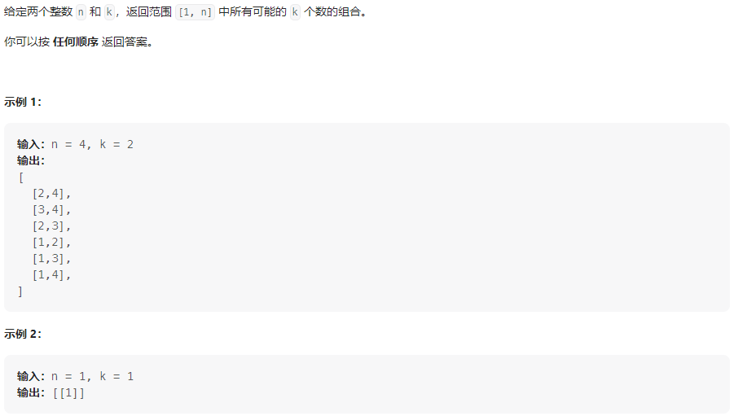

### 我的思路

组合问题的状态树如下，取n=4，k=2(这里借用代码随想录的图)


考虑如下几个问题

**1、函数定义**

```java
// 从状态空间[begin,n]中选择元素，放在决策向量vec中
void backtracing(int n, int begin, LinkedList<Integer> vec);
```

**2、终止条件**

vec.size()==begin时，搜索到达状态树的叶子节点，收集答案，并返回结果

**3、单层逻辑**

```java
// 从[begin, n]中一次尝试每个元素，并进入下一个子状态空间
for (int i = begin; i <= n ; i++) {
    vec.add(i);
    backtracing(k, n, i + 1);
    vec.removeLast();
}
```

#### 剪枝

当状态空间元素数目已经不足要搜索的个数时，则不需要继续往下搜索了，也就是说状态空间剩余的元素数目$num=n-i+1+vec.size()\ge k$，即$i\le n-(k-vec.size())+1$

### 我的代码

**无剪枝**

```java
class Solution {
    List<List<Integer>> ans = new ArrayList<>();
    LinkedList<Integer> vec = new LinkedList<>();

    void backtracing(int k, int n, int begin) {
        // 终止条件
        if (k == vec.size()) {
            ans.add(new ArrayList<>(vec));
            return;
        }
        // 单层逻辑
        for (int i = begin; i <= n; i++) {
            vec.add(i);
            backtracing(k, n, i + 1);
            vec.removeLast();
        }
    }

    public List<List<Integer>> combine(int n, int k) {
        backtracing(k, n, 1);
        return ans;
    }
}
```

**剪枝**

```java
class Solution {
    List<List<Integer>> ans = new ArrayList<>();
    LinkedList<Integer> vec = new LinkedList<>();

    void backtracing(int k, int n, int begin) {
        // 终止条件
        if (k == vec.size()) {
            ans.add(new ArrayList<>(vec));
            return;
        }
        // 单层逻辑
        for (int i = begin; i <= n - (k - vec.size()) + 1; i++) {
            vec.add(i);
            backtracing(k, n, i + 1);
            vec.removeLast();
        }
    }

    public List<List<Integer>> combine(int n, int k) {
        backtracing(k, n, 1);
        return ans;
    }
}
```

## 216.组合总和III

### 题目描述

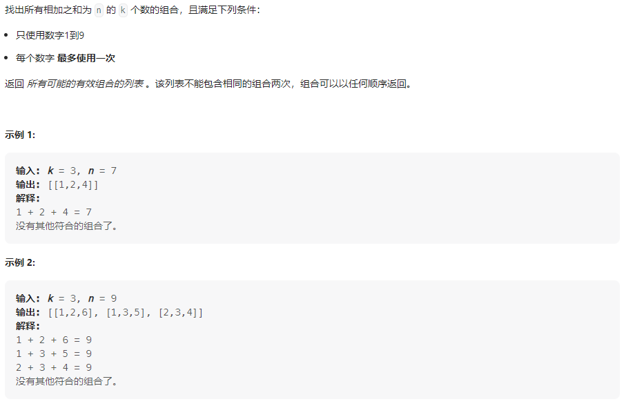

### 我的思路

这里借用代码随想录的状态树，如下


考虑如下几个问题：

**1、函数定义**

```java
// 从[begin, N]选择k个和为n的数
List<List<Integer>> ans = new ArrayList<>();
LinkedList<Integer> vec = new LinkedList<>();
final int N = 9;
void backtracing(int k, int n, int begin);
```

**2、终止条件**

- 当$k==vec.size()$时，若n==0则保存答案，return

- n <= 0，返回

**3、单层逻辑**

```java
//剪枝：当状态空间元素数目小于k-vec.size()时，返回结果
for (int i = begin; i <= N - (k - vec.size()) + 1; i++) {
    vec.add(i);
    backtracing(k, n - i, i + 1);
    vec.removeLast();
}
```

### 我的代码

```java
class Solution {
    List<List<Integer>> ans = new ArrayList<>();
    LinkedList<Integer> vec = new LinkedList<>();
    final int N = 9;

    void backtracing(int k, int n, int begin) {
        // 终止条件
        if (k == vec.size()) {
            if (n == 0)
                ans.add(new ArrayList(vec));
            return;
        } else if (n <= 0)
            return;
        // 单层逻辑
        for (int i = begin; i <= N - (k - vec.size()) + 1; i++) {
            vec.add(i);
            backtracing(k, n - i, i + 1);
            vec.removeLast();
        }
    }

    public List<List<Integer>> combinationSum3(int k, int n) {
        backtracing(k, n, 1);
        return ans;
    }
}
```

## 39. 组合总和

### 题目描述

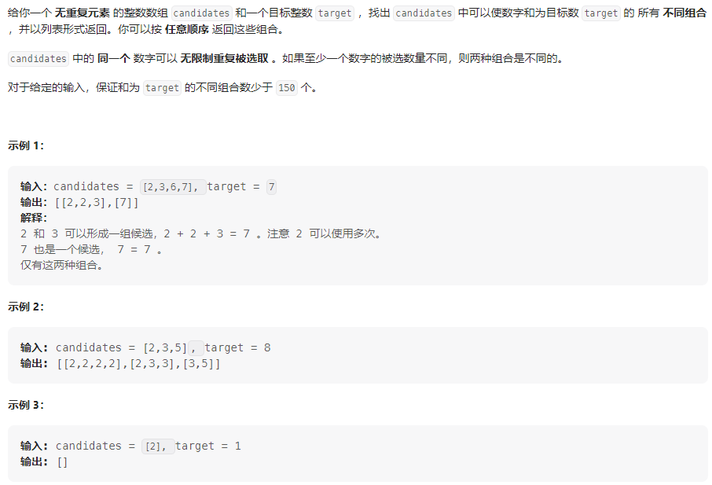

### 我的思路

### 我的代码

## 40.组合总和II

### 题目描述

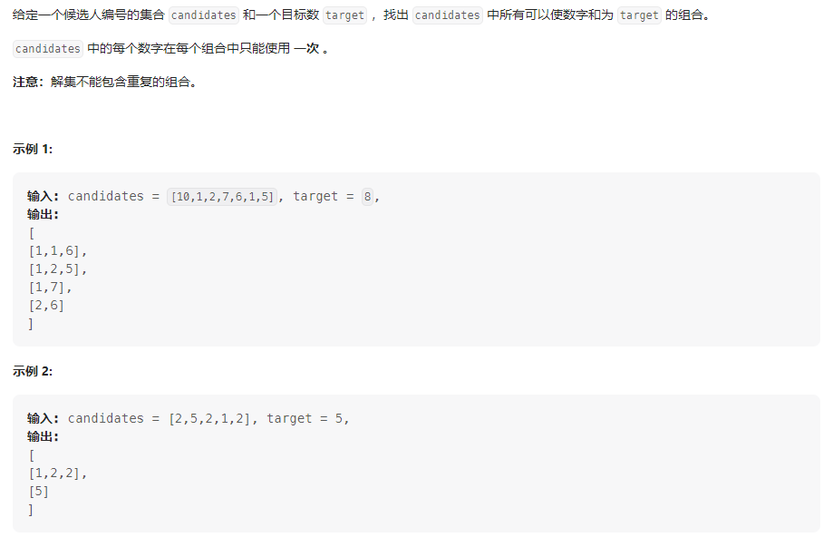

### 我的思路

以[1,1,2]为例，绘制如下状态树(这里借用代码随想录的图)


由于候选集中可能存在重复元素，所以需要在[39. 组合总和]()的基础上进行去重操作，在树的同一层上进行去重，使用过的元素不能在次使用，由于候选集的位置不影响结果，可以事先对候选集排序，然后相邻元素相同的情况不进行二次处理。

### 我的代码

```java
class Solution {
    List<List<Integer>> ans = new ArrayList();
    LinkedList<Integer> vec = new LinkedList<>();

    void backtracing(int target, int[] nums, int begin) {
        // 终止条件
        if (target == 0) {
            // 找到答案
            ans.add(new ArrayList<>(vec));
            return;
        }
        // 单层逻辑
        for (int i = begin; i < nums.length && target - nums[i] >= 0; i++) {
            // 同一树层去重
            if (i ！= begin && nums[i] == nums[i - 1])
                continue;
            vec.add(nums[i]);
            backtracing(target - nums[i], nums, i + 1);
            vec.removeLast();
        }
    }

    public List<List<Integer>> combinationSum2(int[] candidates, int target) {
        Arrays.sort(candidates);
        backtracing(target, candidates, 0);
        return ans;
    }
}
```


## 131.分割回文串

### 题目描述

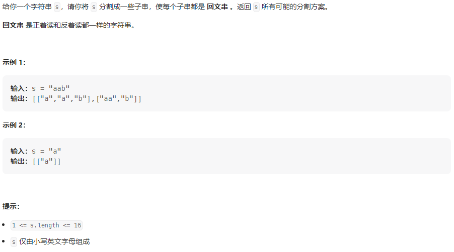

### 我的思路

绘制出问题的状态树(这里借用代码随想录的图)：


如图所示，该问题可以转化成字符缝隙的组合，以图示为例，可解释为使用一个缝隙切割字符串，使用两个缝隙切割字符串，使用三个缝隙切割字符串，即字符串的切割方式有$C_3^1+C_3^2+C_3^3=2^3-1$种。则该问题可使用组合数计算框架，每次从解空间[begin,n]中选择一个位置进行切割。解决如下三个问题

**1、函数定义**

```java
List<List<String>> ans = new ArrayList<>();
// 从来记录每种分割方式下的字串集合
LinkedList<String> vec = new LinkedList<>();
// 从[begin,n]空间中选择一个位置，切割字符串s
void backtracing(int n, int begin, String s);
```

**2、终止条件**

当切割位置到达字符串结尾位置，即begin==s.length()，此时到达状态数的叶子节点

**3、单层逻辑**

```java
// 从[begin,n]空间中选择一个位置i分割字符串s
// 分割后的字符串为[begin, i]
for (int i = begin; i < s.length(); i++) {
    String sub = s.substring(begin, i + 1);
    if (isPalindrome(sub)) {
        vec.add(sub);
        backtracing(s, i + 1);
        vec.removeLast();
    }
}
```

**时间复杂度：**

计算分割方式的时间复杂度为$O(2^N)$，判断回文串的时间复杂度为$O(N)$，总的时间复杂度为$O(N*2^N)$

### 我的代码

```java
class Solution {
    List<List<String>> ans = new ArrayList<>();
    LinkedList<String> vec = new LinkedList<>();
    Map<String, Boolean> map = new HashMap<>();

    // 判断s是不是回文串
    boolean isPalindrome(String s) {
        char[] s_char = s.toCharArray();
        int l = 0, r = s_char.length - 1;
        while (l < r) {
            if (s_char[l] != s_char[r])
                return false;
            l++;
            r--;
        }
        return true;
    }

    void backtracing(String s, int begin) {
        if (s.length() == begin) {
            // 处理答案
            ans.add(new ArrayList(vec));
            return;
        }
        // 单层逻辑
        for (int i = begin; i < s.length(); i++) {
            String sub = s.substring(begin, i + 1);
            if (isPalindrome(sub)) {
                vec.add(sub);
                backtracing(s, i + 1);
                vec.removeLast();
            }
        }
    }

    public List<List<String>> partition(String s) {
        backtracing(s, 0);
        return ans;
    }
}
```


## 78.子集

### 题目描述

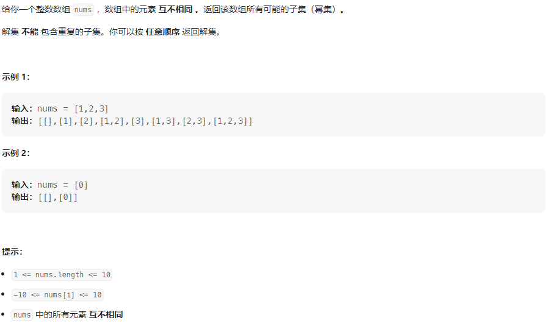

### 我的思路

参考[代码随想录](https://programmercarl.com/0078.%E5%AD%90%E9%9B%86.html)

> 如果把 子集问题、组合问题、分割问题都抽象为一棵树的话，**那么组合问题和分割问题都是收集树的叶子节点，而子集问题是找树的所有节点！**
>
> 
>
> 其实子集也是一种组合问题，因为它的集合是无序的，子集{1,2} 和 子集{2,1}是一样的。
>
> **那么既然是无序，取过的元素不会重复取，写回溯算法的时候，for就要从startIndex开始，而不是从0开始！**
>
> 
>
> 什么时候for可以从0开始呢？
>
> 求排列问题的时候，就要从0开始，因为集合是有序的，{1, 2} 和{2, 1}是两个集合

以nums=[1,2,3]为例绘制子集问题状态树(这里借用代码随想录的图)


如图所示，红线部分为子集集合，即在遍历这棵树的同时保存每个节点的结果，即为最终结果。

> 由于子集问题需要遍历状态树的所有节点，所以不存在剪枝的情况

### 我的代码

代码部分与[77.组合](https://leetcode.cn/problems/combinations/solutions/2332183/jian-zhi-you-hua-shi-jian-1ms-by-dpbirde-p6q8/)大致相同，只不过在每处理一个树节点时，将vec加入答案ans即可。

从状态树中可以看出，当剩余集合为空时到达树的叶子节点即begin=nums.length，为了保持代码的统一性，不单独处理叶子节点的逻辑，可以让函数到达空节点即begin=nums.length+1时终止，此时叶子节点的逻辑会在单层逻辑中处理。

又因为当begin==nums.length + 1时，循环本来就不会执行，所以判断终止条件的代码可以不要。

```java
class Solution {
    List<List<Integer>> ans = new ArrayList<>();
    LinkedList<Integer> vec = new LinkedList<>();

    void backtracing(int[] nums, int begin) {
        // 终止条件，叶子节点
        if (begin == nums.length + 1) {
            return;
        }
        // 处理父节点
        ans.add(new ArrayList(vec));
        // 处理子节点
        for (int i = begin; i < nums.length; i++) {
            vec.add(nums[i]);
            backtracing(nums, i + 1);
            vec.removeLast();
        }
    }

    public List<List<Integer>> subsets(int[] nums) {
        backtracing(nums, 0);
        return ans;
    }
}
```

## 90.子集II

### 题目描述

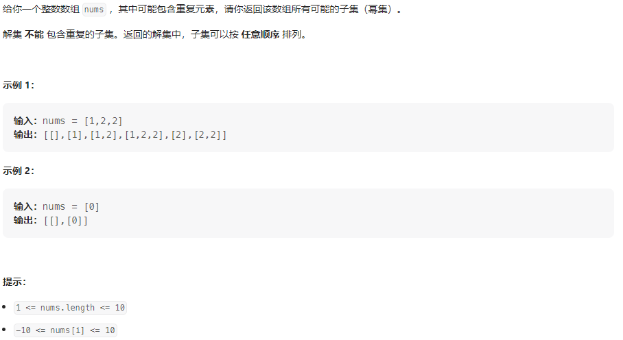

### 我的思路

绘制集合nums=[1，2，3]的状态树(这里借用代码随想录的图)


根据题意集合中可能存在重复元素，所以在[78.子集](https://leetcode.cn/problems/subsets/solutions/2337153/hui-su-fa-qiu-zi-ji-shi-jian-fu-za-du-o2-nywf/)基础上增加去重操作，这里需要避免的重复元素在树的同一层，所以可以使用与[40.组合总和II](https://leetcode.cn/problems/combination-sum-ii/solutions/2337184/hui-su-jian-zhi-qu-zhong-shi-jian-2ms-by-nwjs/)相同的去重操作即可。

### 我的代码

```java
class Solution {
    List<List<Integer>> ans = new ArrayList();
    LinkedList<Integer> vec = new LinkedList();

    void backtracing(int[] nums, int begin) {
        // 终止条件
        if (begin == nums.length + 1) {
            return;
        }
        ans.add(new ArrayList<>(vec));
        for (int i = begin; i < nums.length; i++) {
            // 去重
            if (i != begin && nums[i] == nums[i - 1])
                continue;
            vec.add(nums[i]);
            backtracing(nums, i + 1);
            vec.removeLast();
        }
    }

    public List<List<Integer>> subsetsWithDup(int[] nums) {
        Arrays.sort(nums);
        backtracing(nums, 0);
        return ans;
    }
}
```


## 491.递增子序列

### 题目描述

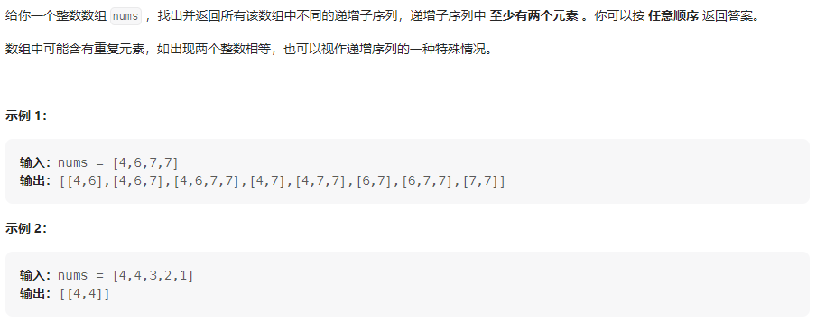

### 我的思路

绘制nums=[4,6,7,7]的状态树(这里借用代码随想录的图)


根据题目描述，在[90.子集II](https://leetcode.cn/problems/subsets-ii/solutions/2337192/hui-su-qu-zhong-jie-jue-zi-ji-wen-ti-shi-04p4/)的基础上有如下几点改变

- 递增子序列==子集

- 递增子序列中至少有两个元素

- 因为要寻找的结果是递增子序列，所以元素位置不能改变，这样去重的策略就需要调整

  > 每一层需要一个哈希表来维护使用过的元素

**问题一：** 寻找的递增子序列为子集的一部分，所以任然可以使用子集的计算框架

**问题二：** 答案集中的每个子序列长度要大于等于2，所以在加入决策向量前要加入一个判断条件

**问题三：** 每层维护一个哈希表，用于存储访问过的元素

```java
// 记录每一层所用的nums中的元素，这里使用数组来维护哈希表
boolean[] used = new boolean[100 * 2 + 10];
```

#### 剪枝策略

由于要求决策向量的长度至少为2，当决策空间的元素数目不足以构成决策向量时，循环终止，即$nums.length - i + vec.size() \ge k$

### 我的代码

```java
class Solution {
    List<List<Integer>> ans = new ArrayList<>();
    LinkedList<Integer> vec = new LinkedList<>();
    final int K = 2;

    void backtracing(int[] nums, int begin) {
        // 终止条件
        if (begin == nums.length + 1) {
            return;
        }
        // 单层逻辑
        if (vec.size() >= 2)
            ans.add(new ArrayList(vec));
        // 记录每一层所用的nums中的元素
        boolean[] used = new boolean[100 * 2 + 10];
        for (int i = begin; i < nums.length  && nums.length - i + vec.size() >= K; i++) {
            // 去重
            if (used[nums[i] + 100])
                continue;
            if (vec.isEmpty() || vec.peekLast() <= nums[i]) {
                vec.add(nums[i]);
                used[nums[i] + 100] = true;
                backtracing(nums, i + 1);
                vec.removeLast();
            }
        }
    }

    public List<List<Integer>> findSubsequences(int[] nums) {
        backtracing(nums, 0);
        return ans;
    }
}
```

## 46.全排列

### 题目描述

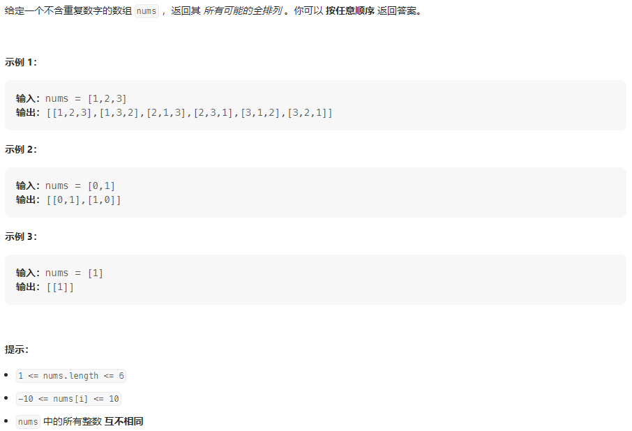

### 我的思路

根据题目描述，排列问题可以理解为==从集合S中选择元素填入N个空中，其中N为元素数目==，共有多少种填法

以nums=[1,2,3]为例，绘制状态树(这里借用代码随想录的图)


从状态树中可以看出，与组合不同的是，在树的每个分支上，用过的元素不能在使用，且不需要begin维护集合开始元素，考虑下面几个问题

**1、函数定义**

```java
List<List<Integer>> ans = new ArrayList<>();
LinkedList<Integer> vec = new LinkedList<>();// vec中存储决策向量

// used用于维护已用过元素的哈希表,key:index,value:boolean
void backtracing(int[] nums, boolean[] used);
```

**2、终止条件**

当决策向量的长度等于集合的长度时，终止

**3、单层逻辑**

遍历集合所有元素，若元素之前没有使用过，尝试把元素加入决策向量中，尝试完成后回溯

```java
for (int i = 0; i < nums.length; i++) {
    if (!used[i]) {
        used[i] = true;
        vec.add(nums[i]);
        backtracing(nums, used);
        vec.removeLast();
        used[i] = false;
    }
}
```

### 我的代码

```java
class Solution {
    List<List<Integer>> ans = new ArrayList<>();
    LinkedList<Integer> vec = new LinkedList<>();

    void backtracing(int[] nums, boolean[] used) {
        // 终止条件
        if (vec.size() == nums.length) {
            ans.add(new ArrayList(vec));
            return;
        }
        // 单层逻辑
        for (int i = 0; i < nums.length; i++) {
            if (!used[i]) {
                used[i] = true;
                vec.add(nums[i]);
                backtracing(nums, used);
                vec.removeLast();
                used[i] = false;
            }
        }
    }

    public List<List<Integer>> permute(int[] nums) {
        boolean[] used = new boolean[nums.length];
        backtracing(nums, used);
        return ans;
    }
}
```

## 47.全排列 II

### 题目描述

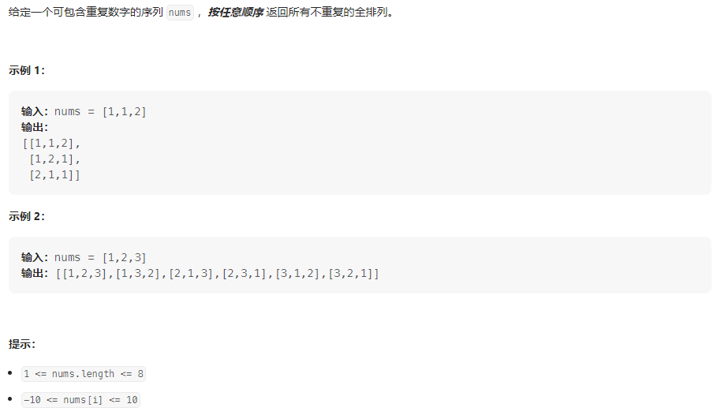

### 我的思路

与[46.全排列](https://leetcode.cn/problems/permutations/solutions/2340066/hui-su-shi-jian-1ms-by-dpbirder-bbhy/)不同的是，这题给定的集合中可能存在重复元素，所以在状态树的每一层需要去重，因为结果与元素顺序无关，所以可以使用与[40.组合总和II](https://leetcode.cn/problems/combination-sum-ii/solutions/2337184/hui-su-jian-zhi-qu-zhong-shi-jian-2ms-by-nwjs/)相同的方法去重，也可以使用数组维护一个哈希表来去重，因为使用前者多了个O(nlogn)的时间复杂度，所以会比后者慢一点。

### 我的代码

```java

import java.util.ArrayList;
import java.util.Arrays;
import java.util.LinkedList;

class Solution {
    List<List<Integer>> ans = new ArrayList<>();
    LinkedList<Integer> vec = new LinkedList<>();
    final int N = 10;

    void backtracing(int[] nums, boolean[] used) {
        // 终止条件
        if (vec.size() == nums.length) {
            ans.add(new ArrayList(vec));
            return;
        }
        // 单层逻辑
        // 记录当前树层使用过的元素
        boolean[] map = new boolean[2 * N + 10];
        for (int i = 0; i < nums.length; i++) {
            // 去重
            if (map[nums[i] + N] || used[i])
                continue;
            vec.add(nums[i]);
            map[nums[i] + N] = true;
            used[i] = true;
            backtracing(nums, used);
            used[i] = false;
            vec.removeLast();
        }
    }

    public List<List<Integer>> permuteUnique(int[] nums) {
        // 记录集合中使用过的元素
        boolean[] used = new boolean[nums.length];
        backtracing(nums, used);
        return ans;
    }
}
```

## 51. N皇后

### 题目描述

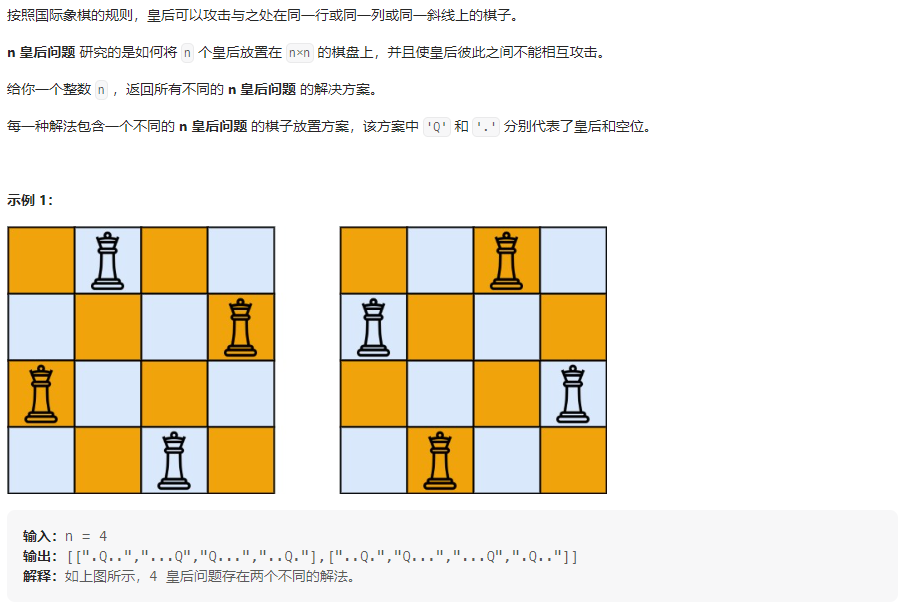

### 我的思路

以n=3为例，绘制状态树(这里借用代码随想录的图)


从状态树种可以看出，棋盘的高度就是状态树的高度，棋盘的深度就是状态树的深度，考虑如下几个问题

**1、函数定义**

```java
List<List<String>> ans = new ArrayList<>();
// 存储每行皇后所处的列数
LinkedList<Integer> vec = new LinkedList<>();
final int N = 10;
boolean[] used = new boolean[N + 5];// 记录已经使用过的列数
// 在row行，分别尝试每一列的皇后位置
void backtracing(int n, int row)；
```

**2、终止条件**

当行数到达最大时，函数终止

**3、单层逻辑**

在row行分别在每一列col尝试皇后位置，若col位置没用使用过且合法，则进行尝试，尝试完进行回溯

```java
for (int i = 1; i <= n; i++) {
    if (!used[i] && isLegal(vec, vec.size() + 1, i)) {
        vec.add(i);
        used[i] = true;
        backtracing(n, row + 1);
        used[i] = false;
        vec.removeLast();
    }
}
```


### 我的代码

```java
class Solution {
    List<List<String>> ans = new ArrayList<>();
    // 存储每行皇后所处的列数
    LinkedList<Integer> vec = new LinkedList<>();
    final int N = 10;
    boolean[] used = new boolean[N + 5];

    boolean isLegal(LinkedList<Integer> vec, int r, int c) {
        int xx = 0;
        for (Integer yy : vec) {
            xx++;
            if (Math.abs(r - xx) == Math.abs(c - yy))
                return false;
        }
        return true;
    }

    void backtracing(int n, int row) {
        // 终止条件
        if (row == n) {
            List<String> method = new ArrayList<>();
            for (Integer col : vec) {
                char[] s_char = new char[n];
                Arrays.fill(s_char, '.');
                s_char[col - 1] = 'Q';
                method.add(new String(s_char));
            }
            ans.add(method);
        }
        // 单层逻辑
        for (int i = 1; i <= n; i++) {
            if (!used[i] && isLegal(vec, vec.size() + 1, i)) {
                vec.add(i);
                used[i] = true;
                backtracing(n, row + 1);
                used[i] = false;
                vec.removeLast();
            }
        }
    }

    public List<List<String>> solveNQueens(int n) {
        backtracing(n, 0);
        return ans;
    }
}
```

