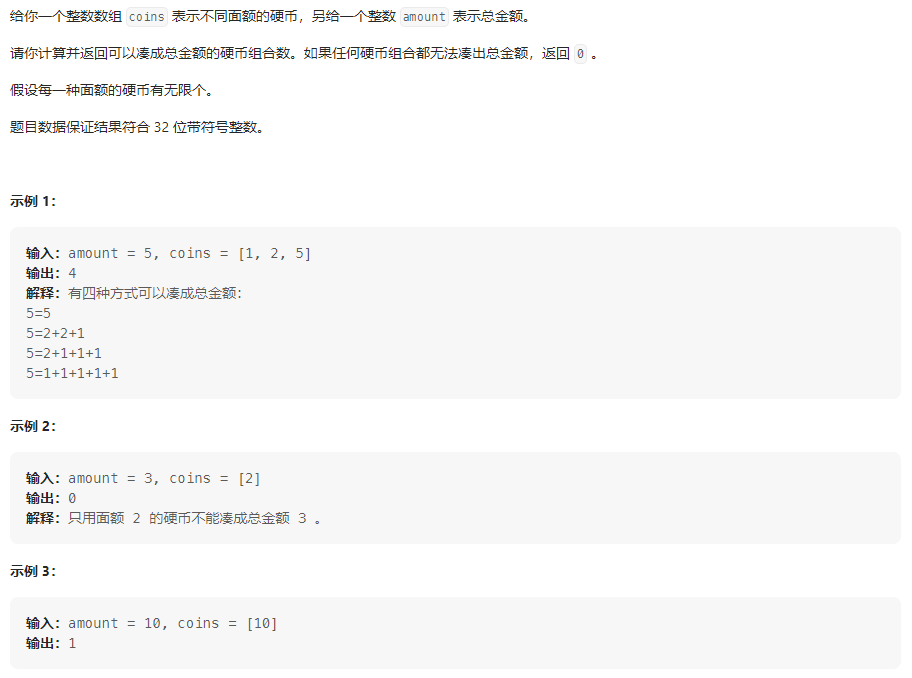
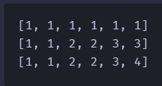
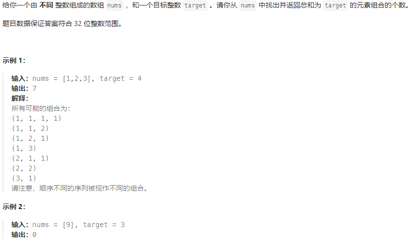
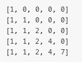
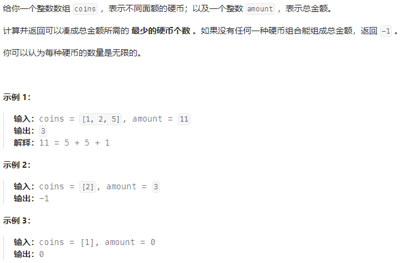
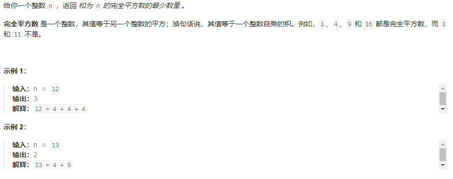

## 完全背包介绍

### 1、问题描述

有N件物品和一个最多能背重量为W的背包。第i件物品的重量是weight[i]，得到的价值是value[i] 。**每件物品都有无限个（也就是可以放入背包多次）**，求解将哪些物品装入背包里物品价值总和最大。

**完全背包和01背包问题唯一不同的地方就是，每种物品有无限件**。

### 2、核心代码

```java
// 先遍历物品，再遍历背包
for(int i = 0; i < weight.size(); i++) { // 遍历物品
    for(int j = weight[i]; j <= bagWeight ; j++) { // 遍历背包容量
        dp[j] = max(dp[j], dp[j - weight[i]] + value[i]);

    }
}
```

<!-- more -->

## 题目汇总

| 题目                                                         | 题解                                                         |
| ------------------------------------------------------------ | ------------------------------------------------------------ |
| [518.零钱兑换II](https://leetcode.cn/problems/coin-change-ii/)(求组合数) | https://leetcode.cn/problems/coin-change-ii/solutions/2394509/dong-tai-gui-hua-qiu-zu-he-shu-xian-bian-ekoz/ |
| [377.组合总和Ⅳ](https://leetcode.cn/problems/combination-sum-iv/)(求排列数) | https://leetcode.cn/problems/combination-sum-iv/solutions/2394538/dong-tai-gui-hua-qiu-pai-lie-shu-xian-bi-k7mq/ |
| [322.零钱兑换](https://leetcode.cn/problems/coin-change/)    |                                                              |
| [279.完全平方数](https://leetcode.cn/problems/perfect-squares/) |                                                              |
| [139.单词拆分](https://leetcode.cn/problems/word-break/)     |                                                              |

## 518.零钱兑换II(求组合数)

### 题目描述



### 我的思路

注意本题与纯完全背包的区别，完全背包要求的是装满背包物品的最大价值，而本题要求的是装满背包最小的物品数，下面考虑动态规划五部曲

1、状态定义

dp[j]：装满背包j所需要的最小物品数

2、状态转移

dp[j] = dp[j - coins[i]]

3、初始化

dp[0] = 1; 为了保证后续的计算正确

4、确定遍历顺序

先说结论，先遍历物品，在遍历背包，求的是组合数；先遍历背包，在遍历物品求的是排列数。

这里是与纯背包问题的主要区别，由于纯背包问题要求的是最大价值与装的物品顺序无关，即有顺序也行，没顺序也行，由于本题要求的是最小组合数，所以得先遍历物品在遍历背包。

对于测试用例nums=[1,2,5],target=5，先遍历物品，在遍历背包的状态如下



### 我的代码

```java
class Solution {

    public int change(int amount, int[] coins) {
        int n = coins.length;
        // dp[j]: 物品装满背包j的组合数
        int[] dp = new int[amount + 1];

        // 状态转移, dp[j] += dp[j - coins[i]],i=1~n
        // 初始化
        dp[0] = 1;
        for (int i = 0; i < n; i++) {
            for (int j = coins[i]; j <= amount; j++)
                dp[j] += dp[j - coins[i]];
        }
        return dp[amount];
    }
}
```

## 377.组合总和IV(求排列数)

先遍历背包，在遍历物品

### 题目描述



### 我的思路

这题与[518.零钱兑换II](https://leetcode.cn/problems/coin-change-ii/solutions/2394509/dong-tai-gui-hua-qiu-zu-he-shu-xian-bian-ekoz/)的区别在于，本题要计算的是排列数，所以遍历顺序应该先遍历背包在遍历物品。

1、状态定义

dp[j]: 装满背包j的组合数

2、状态转移

dp[j] = dp[j - nums[i]]

3、初始化

dp[0] = 1

4、确定遍历顺序

如何思考排列遍历顺序？

因为本题与位置有关，对于背包j所有物品都需要尝试一边，即确定了j后需要尝试所有的i，所以先遍历背包在遍历物品

对于测试用例nums=[1,2,3],target=4，先遍历背包,在遍历物品状态如下



### 我的代码

```java
class Solution {
    public int combinationSum4(int[] nums, int target) {
        int n = nums.length;
        Arrays.sort(nums);
        // dp[j]: 装满背包j的组合数
        int[] dp = new int[target + 1];
        // 状态转移：dp[j] += dp[j - nums[i]], i=1~n
        // 初始化
        dp[0] = 1;
        for (int j = 0; j <= target; j++) {
            for (int i = 0; i < n; i++)
                if (j >= nums[i])
                    dp[j] += dp[j - nums[i]];
        }
        return dp[target];
    }
}
```

## 322. 零钱兑换

### 题目描述



### 我的思路


### 我的代码

```java
class Solution {
    public int coinChange(int[] coins, int amount) {
        // dp[j]: 装满背包j所需要的最小物品数
        int dp[] = new int[amount + 1];
        // 状态转移： dp[j] = min(dp[j], dp[j - coins[i]] + 1)
        // 初始化
        Arrays.fill(dp, Integer.MAX_VALUE);
        dp[0] = 0;
        for (int i = 0; i < coins.length; i++) {
            for (int j = coins[i]; j <= amount; j++)
                if (dp[j - coins[i]] != Integer.MAX_VALUE)
                    dp[j] = Math.min(dp[j], dp[j - coins[i]] + 1);
        }
        return dp[amount] == Integer.MAX_VALUE ? -1 : dp[amount];
    }
}
```

##  279.完全平方数

### 题目描述



### 我的思路

1、状态定义

dp[j]: 和为j的完全平方数的最小数量

2、状态转移

dp[j]=min(dp[j], dp[j-i*i]+1)

3、初始化

根据状态转移方程来看，初始化需要为较大的值，在之后的递归过程中才不会被初始值覆盖

且dp[0] = 0

4、遍历顺序

由于这里要求的是最小物品数目，与物品的的顺序没有关系，所以这里先遍历物品在遍历背包和先遍历背包在遍历物品都可以

### 我的代码

```java
// 先遍历背包，在遍历物品
class Solution {
    public int numSquares(int n) {
        square = new ArrayList<>();
        // dp[i]: 和为i的最小完全平方数的数目
        int []dp = new int[n + 1];
        Arrays.fill(dp, Integer.MAX_VALUE);
        dp[0] = 0;
        // 状态转移：dp[j] = min(dp[j], dp[j - i*i] + 1);
        // 初始化
        dp[0] = 0;
        for (int j = 1; j <= n; j++) {
            for (int i = 1; i * i <= j; i++)
                dp[j] = Math.min(dp[j], dp[j - i * i] + 1);
        }
        return dp[n];
    }
}

// 先遍历物品，在遍历背包
class Solution {
    public int numSquares(int n) {
        square = new ArrayList<>();
        // dp[i]: 和为i的最小完全平方数的数目
        int []dp = new int[n + 1];
        Arrays.fill(dp, Integer.MAX_VALUE);
        dp[0] = 0;
        // 状态转移：dp[j] = min(dp[j], dp[j - i*i] + 1);
        // 初始化
        dp[0] = 0;
        for (int i = 1; i * i <= n; i++) {
            for (int j = i * i; j <= n; j++)
                dp[j] = Math.min(dp[j], dp[j - i * i] + 1);
        }
        return dp[n];
    }
```

